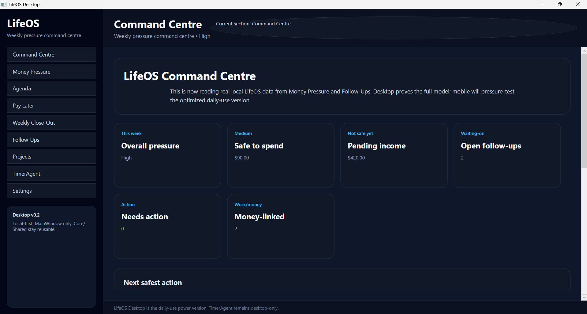
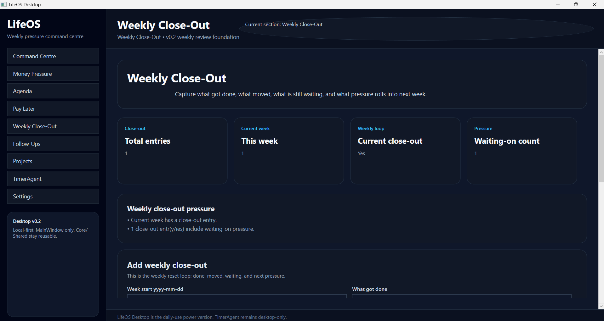
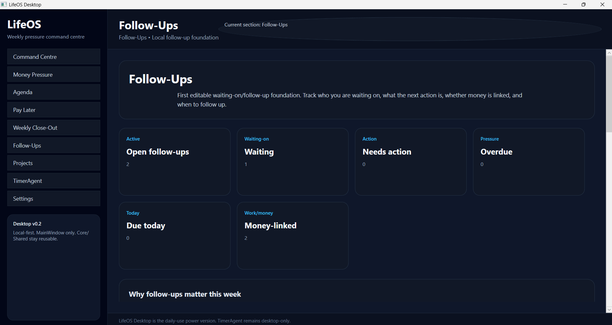

# LifeOS

LifeOS is a weekly pressure command centre.

It shows what money, work, payments, deductions, agenda items, follow-ups, deferred obligations, and weekly review items are putting pressure on the week, then helps decide what is safe to do next.

LifeOS is not mainly a budget app, calendar app, task app, timer app, or banking app. Those are modules and inputs. LifeOS is the pressure layer that connects them.

## LifeOS Desktop v0.2

LifeOS Desktop v0.2 is the second working proof of the LifeOS weekly pressure command centre.

v0.1 proved that LifeOS exists as a real desktop application. v0.2 upgrades the app so it understands more of the week: agenda pressure, pay-later/deferred obligations, and weekly close-out review.

This version includes:

- WPF desktop shell
- MainWindow-only UI for fast iteration
- shared Core / Shared architecture
- Money Pressure manual inputs with local JSON persistence
- Follow-Ups tracking with local JSON persistence
- Agenda foundation with local JSON persistence
- Pay Later foundation with local JSON persistence
- Weekly Close-Out foundation with local JSON persistence
- Command Centre summary reading local pressure data
- TimerAgent framed as a desktop-only utility that can later feed work/time/income into LifeOS

This is a private alpha/proof build, not a public commercial release.

## Current Screenshot



## v0.2 Screenshots

### Command Centre


### Agenda


### Pay Later


### Weekly Close-Out



### Money Pressure


### Follow-Ups



## Current Features

### Command Centre

The Command Centre combines saved LifeOS pressure data and shows:

- overall pressure
- safe-to-spend
- pending income
- open follow-ups
- needs-action follow-ups
- money-linked follow-ups
- next safest action
- combined pressure reasons

v0.2 also lays the foundation for Agenda, Pay Later, and Weekly Close-Out data to become part of the weekly pressure loop.

### Money Pressure

Money Pressure supports manual weekly values:

- current balance
- paid income
- pending income
- bills due
- deductions
- food/fuel buffer
- emergency buffer

The module calculates:

- safe-to-spend
- pressure label
- pending income kept separate from safe money
- reasons why the week has pressure

### Agenda

Agenda tracks what matters this week:

- title
- type
- status
- pressure level
- due date
- time text
- fixed commitment flag
- notes

The module calculates:

- open agenda items
- due-today items
- overdue items
- items due this week
- high-pressure items
- pressure reasons

### Pay Later

Pay Later tracks deferred obligations before they become hidden pressure:

- name
- payee
- amount
- due date
- status
- pressure level
- notes

The module calculates:

- open pay-later items
- open amount
- due-this-week amount
- overdue amount
- high-pressure item count
- pressure reasons

### Weekly Close-Out

Weekly Close-Out captures the weekly reset loop:

- week start
- what got done
- what moved
- what is still waiting
- next-week pressure
- notes

The module calculates:

- total close-out entries
- current-week entries
- whether the current week has a close-out
- waiting-on pressure count
- pressure reasons

### Follow-Ups

Follow-Ups supports basic waiting-on tracking:

- person / organisation
- context
- next action
- follow-up date
- status
- priority
- money-linked flag
- notes

The module calculates:

- open follow-ups
- waiting count
- needs-action count
- overdue count
- due-today count
- money-linked count

### TimerAgent

TimerAgent is the first desktop-only LifeOS utility.

It tracks focused work, billable sessions, earned income, tax set-aside, safe money, and CSV logs.

TimerAgent remains desktop-only because its core UX depends on desktop-specific behaviour such as tray icon, global shortcut, compact overlay, and local work-session flow.

Future LifeOS versions can read TimerAgent work-session data into the Command Centre.

## Platform Direction

Desktop is the daily-use power version and proving ground.

Mobile will be the daily-use optimized version and pressure test.

Both desktop and mobile should share the same core LifeOS model.

Core features should reach both desktop and mobile once the desktop/core model is stable enough.

Experimental features start on desktop.

Platform-specific features stay platform-specific.

## Solution Structure

```text
src/LifeOS.Core
LifeOS.Shared
src/LifeOS.Modules.Timer
src/LifeOS.TimerAgent
LifeOS.Desktop
```

## Storage

LifeOS Desktop v0.2 uses local JSON persistence.

Current local files include:

- `money-pressure-input.json`
- `follow-ups.json`
- `agenda-items.json`
- `pay-later-items.json`
- `weekly-close-out-entries.json`

## Not Built Yet

- mobile app
- website
- database
- bank sync
- email/calendar import
- TimerAgent CSV import into Command Centre
- Work Sessions module
- Proof Tracker module
- backup/restore
- data health checks
- installer
- public release packaging

## Run

From the solution root:

```powershell
dotnet build
dotnet run --project .\LifeOS.Desktop\LifeOS.Desktop.csproj
```

## Documentation

- [v0.2 release notes](docs/LIFEOS_DESKTOP_V0.2_RELEASE_NOTES.md)
- [v0.2 test checklist](docs/LIFEOS_DESKTOP_V0.2_TEST_CHECKLIST.md)
- [v0.2 screenshot list](docs/LIFEOS_DESKTOP_V0.2_SCREENSHOT_LIST.md)
- [Roadmap](docs/LIFEOS_ROADMAP.md)
- [Platform architecture](docs/PLATFORM_ARCHITECTURE.md)
- [Mobile plan](docs/MOBILE_PLAN.md)
- [Website plan](docs/WEBSITE_PLAN.md)
