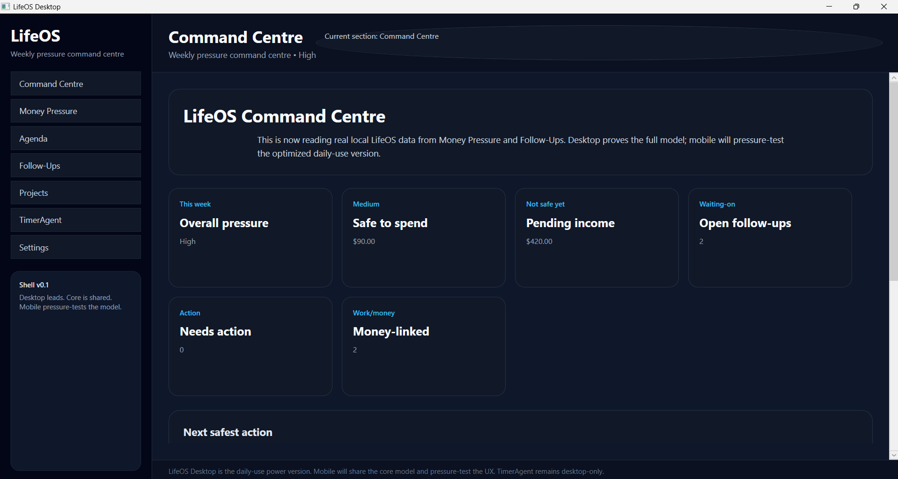
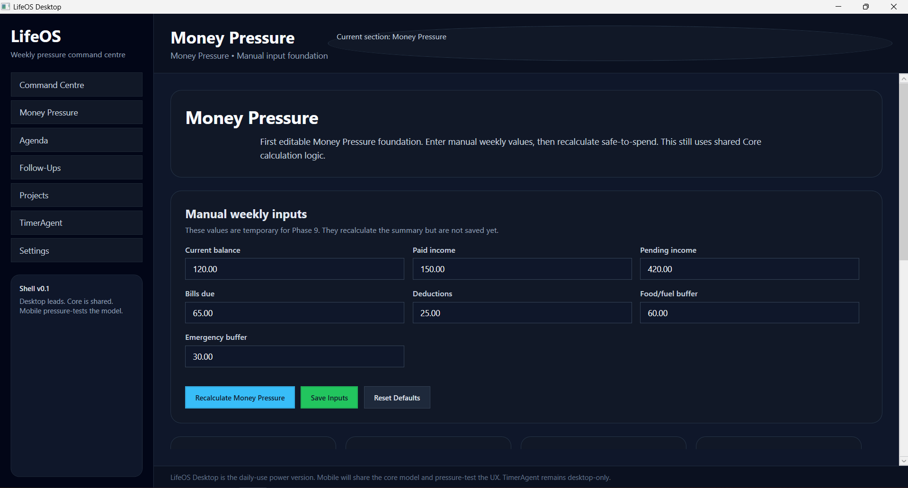
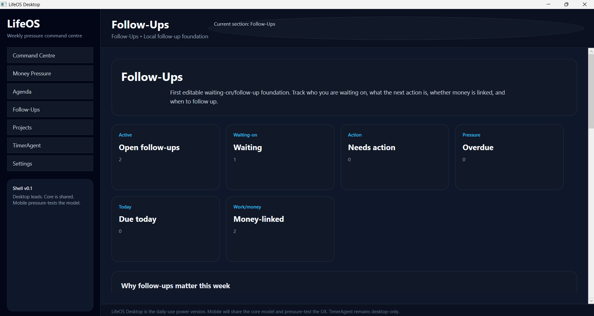
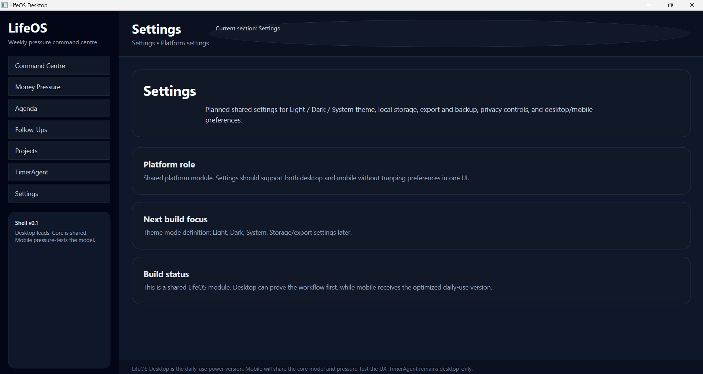
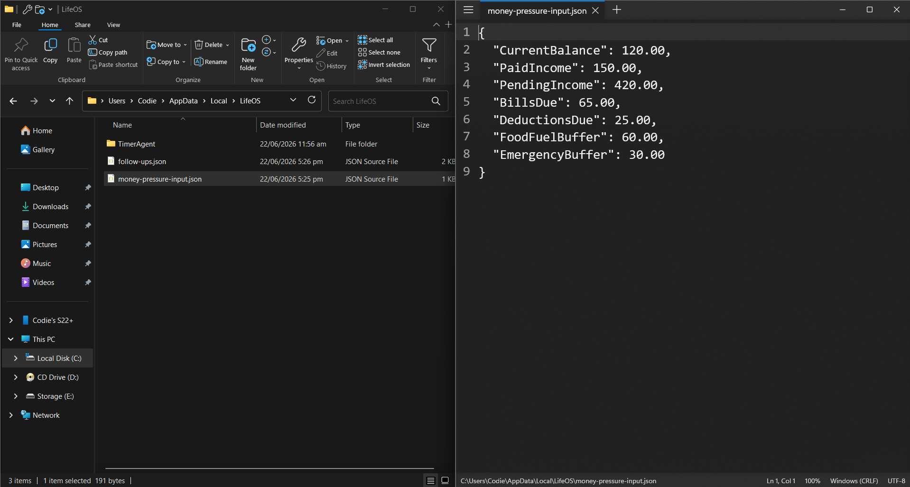
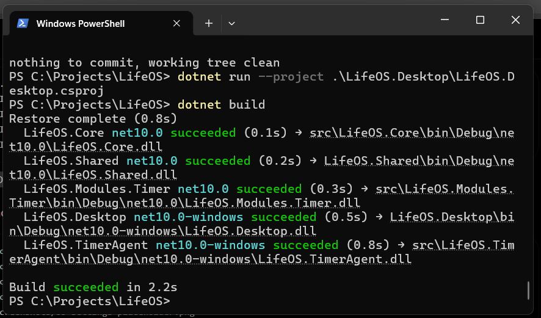

# LifeOS

LifeOS is a weekly pressure command centre.

It shows what money, work, payments, deductions, appointments, tasks, messages, and follow-ups are putting pressure on the week, then helps decide what is safe to do next.

LifeOS is not mainly a budget app, calendar app, task app, timer app, or banking app. Those are modules and inputs. LifeOS is the pressure layer that connects them.

## LifeOS Desktop v0.1

LifeOS Desktop v0.1 is the first working proof of the LifeOS weekly pressure command centre.

It includes a WPF desktop shell, shared platform architecture, Money Pressure manual inputs with local persistence, Follow-Ups tracking with local persistence, and a Command Centre summary that combines local money and follow-up pressure.

This version proves the core LifeOS direction:

- Desktop is the daily-use power version and proving ground.
- Mobile will be the daily-use optimized version and pressure test.
- Core and Shared projects hold reusable LifeOS logic and app-facing structure.
- TimerAgent remains a desktop-only utility that feeds work/time/income data into LifeOS.

This is a private alpha/proof build, not a public commercial release.

## Screenshots

### Command Centre Summary



### Money Pressure Inputs



### Follow-Ups Foundation



### TimerAgent Desktop Utility


### Settings Placeholder



### Local JSON Persistence



### Build Passing



## Current Features

### Command Centre

The Command Centre reads local Money Pressure and Follow-Ups data and shows:

- overall pressure
- safe-to-spend
- pending income
- open follow-ups
- needs-action follow-ups
- money-linked follow-ups
- next safest action
- combined pressure reasons

### Money Pressure

Money Pressure supports manual weekly values:

- current balance
- paid income
- pending income
- bills due
- deductions
- food/fuel buffer
- emergency buffer

The module calculates:

- safe-to-spend
- pressure label
- pending income kept separate from safe money
- reasons why the week has pressure

### Follow-Ups

Follow-Ups supports basic waiting-on tracking:

- person / organisation
- context
- next action
- follow-up date
- status
- priority
- money-linked flag
- notes

The module calculates:

- open follow-ups
- waiting count
- needs-action count
- overdue count
- due-today count
- money-linked count

### TimerAgent

TimerAgent is the first desktop-only LifeOS utility.

It tracks focused work, billable sessions, earned income, tax set-aside, safe money, and CSV logs.

TimerAgent remains desktop-only because its core UX depends on desktop-specific behaviour such as tray icon, global shortcut, compact overlay, and local work-session flow.

Future LifeOS versions can read TimerAgent work-session data into the Command Centre.

## Platform Direction

Desktop is the daily-use power version and proving ground.

Mobile will be the daily-use optimized version and pressure test.

Both desktop and mobile share the same core LifeOS model.

Core features should reach both desktop and mobile.

Experimental features start on desktop.

Platform-specific features stay platform-specific.

## Solution Structure

```text
LifeOS.Core
LifeOS.Shared
LifeOS.Modules.Timer
LifeOS.TimerAgent
LifeOS.Desktop
```

## Storage

LifeOS Desktop v0.1 uses local JSON persistence.

Current local files include:

- `money-pressure-input.json`
- `follow-ups.json`

## Not Built Yet

- mobile app
- website
- database
- bank sync
- email/calendar import
- TimerAgent CSV import into Command Centre
- agenda module
- pay-later tracker
- weekly close-out
- installer
- public release packaging

## Run

From the solution root:

```powershell
dotnet build
dotnet run --project .\LifeOS.Desktop\LifeOS.Desktop.csproj
```

If your project layout uses `src`, run the matching `src\LifeOS.Desktop\LifeOS.Desktop.csproj` path instead.

## Documentation

- [Release notes](docs/LIFEOS_DESKTOP_V0.1_RELEASE_NOTES.md)
- [Test checklist](docs/LIFEOS_DESKTOP_V0.1_TEST_CHECKLIST.md)
- [Screenshot list](docs/LIFEOS_DESKTOP_V0.1_SCREENSHOT_LIST.md)
- [Platform architecture](docs/PLATFORM_ARCHITECTURE.md)
- [Mobile plan](docs/MOBILE_PLAN.md)
- [Website plan](docs/WEBSITE_PLAN.md)
