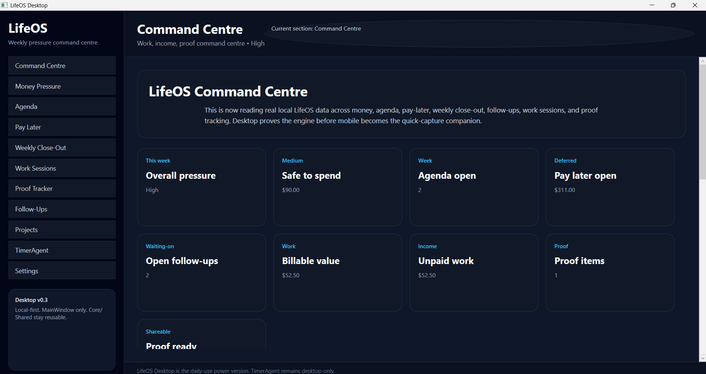
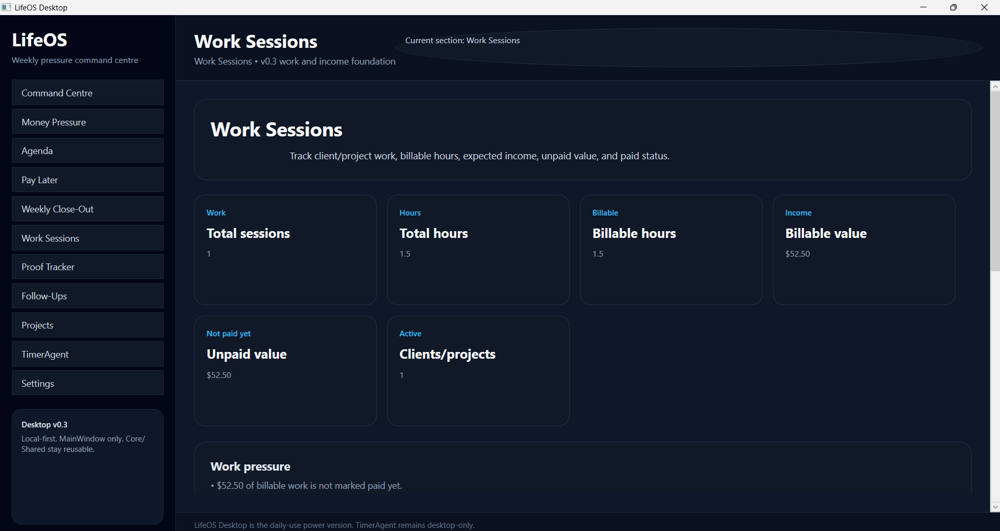
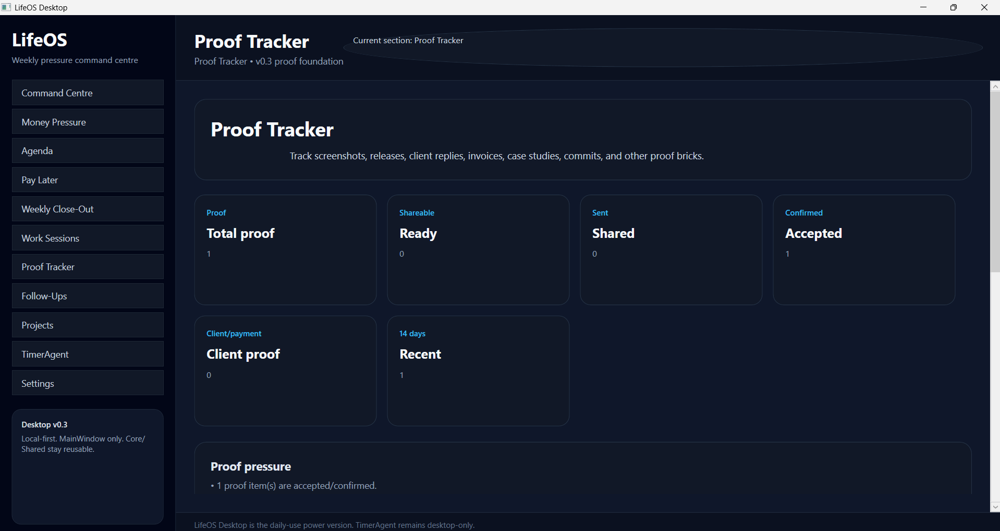
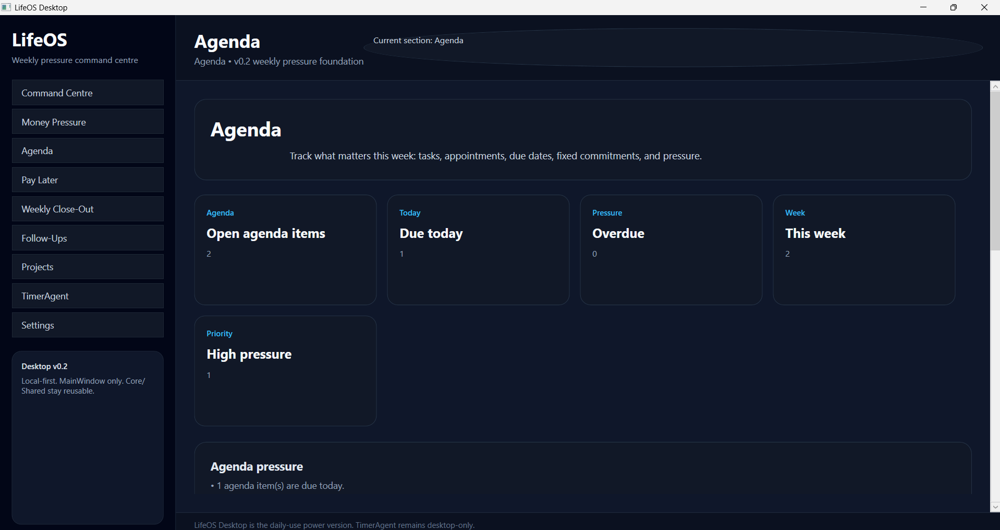
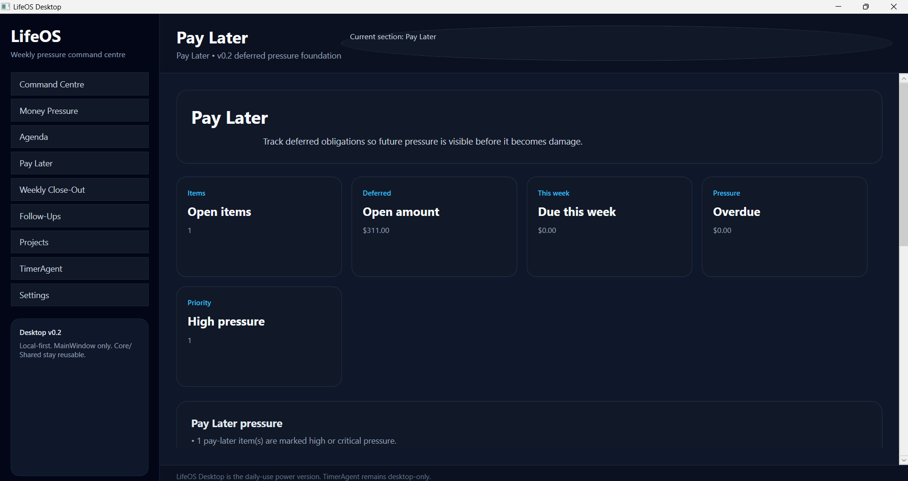
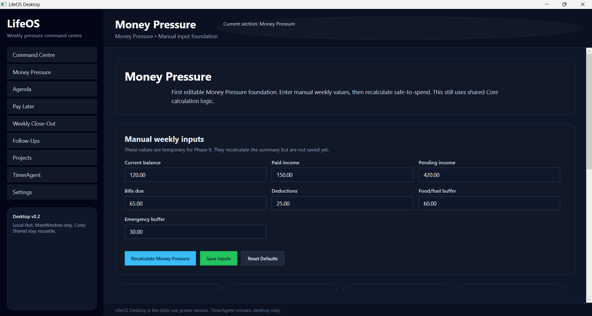

# LifeOS

LifeOS is a weekly pressure command centre.

It shows what money, work, payments, deductions, agenda items, follow-ups, deferred obligations, weekly review items, work sessions, unpaid income, and proof items are putting pressure on the week, then helps decide what is safe to do next.

LifeOS is not mainly a budget app, calendar app, task app, timer app, CRM, or banking app. Those are modules and inputs. LifeOS is the pressure layer that connects them.

## LifeOS Desktop v0.3

LifeOS Desktop v0.3 is the third working proof of the LifeOS weekly pressure command centre.

v0.1 proved that LifeOS exists as a real desktop application. v0.2 made LifeOS understand the week. v0.3 upgrades the app so it understands work, income, and proof.

This version includes:

- WPF desktop shell
- MainWindow-only UI for fast iteration
- shared Core / Shared architecture
- Money Pressure manual inputs with local JSON persistence
- Follow-Ups tracking with local JSON persistence
- Agenda foundation with local JSON persistence
- Pay Later foundation with local JSON persistence
- Weekly Close-Out foundation with local JSON persistence
- Work Sessions foundation with local JSON persistence
- Proof Tracker foundation with local JSON persistence
- Command Centre summary reading local pressure, work, income, and proof data
- TimerAgent framed as a desktop-only utility that can later feed work/time/income into LifeOS

This is a private alpha/proof build, not a public commercial release.

## Current Screenshot



## v0.3 Screenshots

### Command Centre


### Work Sessions



### Proof Tracker



### Agenda



### Pay Later



### Weekly Close-Out


### Money Pressure



### Follow-Ups


## Current Features

### Command Centre

The Command Centre combines saved LifeOS pressure data and shows:

- overall pressure
- safe-to-spend
- agenda pressure
- pay-later/deferred obligation pressure
- open follow-ups
- billable value
- unpaid work value
- proof items
- proof-ready status
- next safest action
- combined pressure reasons

v0.3 connects the work/income/proof loop to the same weekly pressure model as money, agenda, pay-later, follow-ups, and weekly close-out.

### Work Sessions

Work Sessions tracks client/project work:

- client or project
- work date
- hours
- hourly rate
- billable flag
- paid/unpaid status
- description
- notes

The module calculates:

- total sessions
- total hours
- billable hours
- billable value
- unpaid value
- active clients/projects
- work pressure reasons

### Proof Tracker

Proof Tracker tracks the evidence wall behind the work:

- project
- title
- proof type
- status
- date
- description
- link or path
- notes

The module calculates:

- total proof items
- ready/shareable items
- shared items
- accepted/confirmed items
- client/payment-related proof
- recent proof items
- proof pressure reasons

### Money Pressure

Money Pressure supports manual weekly values:

- current balance
- paid income
- pending income
- bills due
- deductions
- food/fuel buffer
- emergency buffer

The module calculates:

- safe-to-spend
- pressure label
- pending income kept separate from safe money
- reasons why the week has pressure

### Agenda

Agenda tracks what matters this week:

- title
- type
- status
- pressure level
- due date
- time text
- fixed commitment flag
- notes

The module calculates:

- open agenda items
- due-today items
- overdue items
- items due this week
- high-pressure items
- pressure reasons

### Pay Later

Pay Later tracks deferred obligations before they become hidden pressure:

- name
- payee
- amount
- due date
- status
- pressure level
- notes

The module calculates:

- open pay-later items
- open amount
- due-this-week amount
- overdue amount
- high-pressure item count
- pressure reasons

### Weekly Close-Out

Weekly Close-Out captures the weekly reset loop:

- week start
- what got done
- what moved
- what is still waiting
- next-week pressure
- notes

The module calculates:

- total close-out entries
- current-week entries
- whether the current week has a close-out
- waiting-on pressure count
- pressure reasons

### Follow-Ups

Follow-Ups supports basic waiting-on tracking:

- person / organisation
- context
- next action
- follow-up date
- status
- priority
- money-linked flag
- notes

The module calculates:

- open follow-ups
- waiting count
- needs-action count
- overdue count
- due-today count
- money-linked count

### TimerAgent

TimerAgent is the first desktop-only LifeOS utility.

It tracks focused work, billable sessions, earned income, tax set-aside, safe money, and CSV logs.

TimerAgent remains desktop-only because its core UX depends on desktop-specific behaviour such as tray icon, global shortcut, compact overlay, and local work-session flow.

Future LifeOS versions can read TimerAgent work-session data into the Command Centre.

## Platform Direction

Desktop is the daily-use power version and proving ground.

Mobile will be the daily-use optimized version and pressure test.

Both desktop and mobile should share the same core LifeOS model.

Core features should reach both desktop and mobile once the desktop/core model is stable enough.

Experimental features start on desktop.

Platform-specific features stay platform-specific.

## Solution Structure

```text
src/LifeOS.Core
LifeOS.Shared
src/LifeOS.Modules.Timer
src/LifeOS.TimerAgent
LifeOS.Desktop
```

## Storage

LifeOS Desktop v0.3 uses local JSON persistence.

Current local files include:

- `money-pressure-input.json`
- `follow-ups.json`
- `agenda-items.json`
- `pay-later-items.json`
- `weekly-close-out-entries.json`
- `work-sessions.json`
- `proof-items.json`

## Not Built Yet

- mobile app
- website
- database
- bank sync
- email/calendar import
- TimerAgent CSV import into Command Centre
- backup/restore
- data health checks
- installer
- public release packaging
- authentication/users
- cloud sync

## Release Status

LifeOS Desktop v0.3 is a local-first proof release.

It proves the core pressure engine can combine personal pressure, weekly pressure, work value, unpaid income, and proof tracking inside one desktop command centre.
