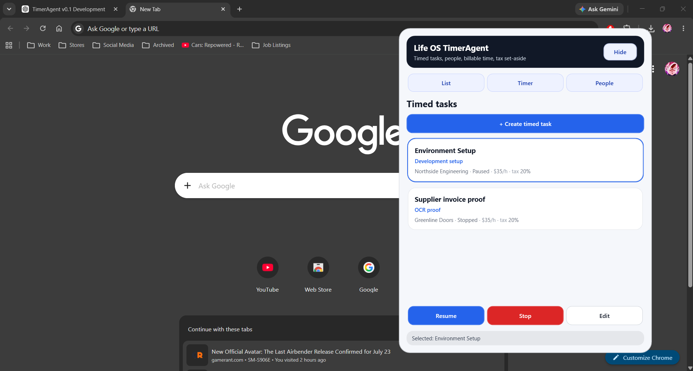
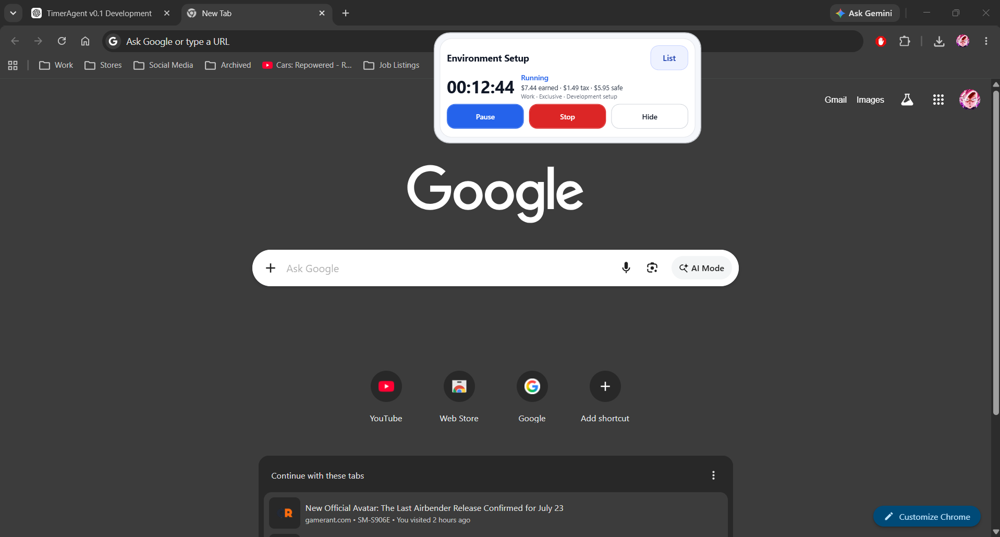
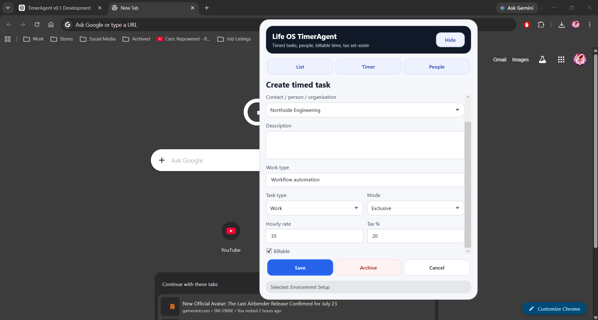
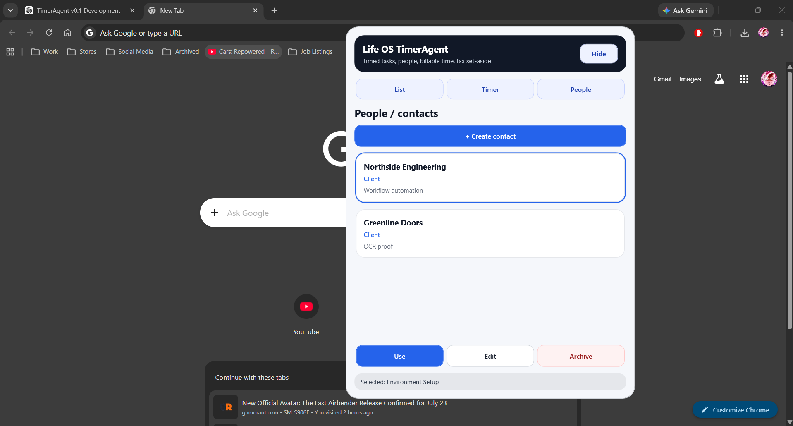

# Life OS TimerAgent

**TimerAgent** is the first usable module of **Life OS**: a local-first WPF timed-task manager for tracking work, people/organisations, billable time, tax set-aside, safe money, and CSV logs.

It is not a generic stopwatch. TimerAgent is designed as a practical work-control layer: choose the task, track the time, see what was earned, separate tax/set-aside money, and keep a simple local record of completed sessions.

---

## Current status

**Version:** TimerAgent v0.1  
**Status:** Feature/UI polish complete  
**App type:** WPF desktop app  
**Storage:** Local JSON state + CSV time log  
**Main use case:** Tracking timed work/tasks linked to contacts/organisations

---

## Why this exists

Contractor and project work often creates a simple problem:

- What am I working on?
- Who is it for?
- How long did I spend?
- What did I earn?
- How much should I set aside?
- What is actually safe money?
- What proof do I have later?

TimerAgent answers those questions without needing a full accounting system, cloud platform, or complex project-management app.

---

## Screenshots

> Add the screenshot files listed below into `docs/screenshots/`. The README already embeds the most important ones.

### Task list / manager view



### Compact timer work mode



### Create/edit timed task



### People / contacts



---

## Core v0.1 features

- Timed task creation and editing
- People/contacts linked to timed tasks
- Start, pause, resume, and stop timer flow
- Direct task actions from the task list
- Compact Timer page for active work mode
- Smart timer action button:
  - `Start` when stopped
  - `Pause` when running
  - `Resume` when paused
- Task-specific totals instead of global totals on the timer page
- Current work day wording for late-night work
- Billable rate, tax set-aside, and safe-after-tax display
- CSV logging when tasks are stopped
- Local JSON persistence for tasks, contacts, and selected state
- Tray/hide support
- Global hotkey support
- Polished WPF UI:
  - full-width task/contact cards
  - styled dropdowns
  - fixed hover states
  - compact timer layout

---

## Project structure

```text
LifeOS/
├─ src/
│  ├─ LifeOS.Core/
│  │  └─ Models/
│  │     ├─ ContactProfile.cs
│  │     └─ ContactType.cs
│  ├─ LifeOS.Modules.Timer/
│  │  ├─ Models/
│  │  │  ├─ TimedTask.cs
│  │  │  ├─ TimedTaskMode.cs
│  │  │  ├─ TimedTaskState.cs
│  │  │  └─ TimedTaskType.cs
│  │  ├─ Services/
│  │  │  ├─ TimerManager.cs
│  │  │  └─ TimerService.cs
│  │  └─ Storage/
│  │     ├─ TimerCsvLogWriter.cs
│  │     └─ TimerLogEntry.cs
│  └─ LifeOS.TimerAgent/
│     ├─ MainWindow.xaml
│     ├─ MainWindow.xaml.cs
│     ├─ Services/
│     └─ Storage/
└─ docs/
   ├─ screenshots/
   ├─ TIMERAGENT_V0.1_RELEASE_NOTES.md
   ├─ TIMERAGENT_V0.1_SCREENSHOT_LIST.md
   └─ TIMERAGENT_V0.1_TEST_CHECKLIST.md
```

---

## How to run

From the repository root:

```powershell
dotnet build
dotnet run --project src/LifeOS.TimerAgent
```

---

## Local data storage

TimerAgent stores local app state and timer logs under the user profile.

```text
%LocalAppData%/LifeOS/TimerAgent/timeragent-state.json
%LocalAppData%/LifeOS/TimerAgent/timer-log.csv
```

### JSON state

Stores:

- contacts
- timed tasks
- selected contact
- selected timed task
- last saved timestamp

### CSV timer log

Writes completed timer sessions after stopping a running/paused task.

The CSV log is intended to provide simple evidence of work sessions and a base for future reporting/invoicing improvements.

---

## v0.1 scope

TimerAgent v0.1 is intentionally local-first and manual-first.

This version focuses on proving the core work loop:

```text
Create contact → create timed task → start work → pause/resume → stop → log time → review task totals
```

The goal is not to be a full CRM, accounting system, calendar, or invoicing platform.

---

## Known limitations

- No installer yet
- No cloud sync
- No database-backed storage yet
- No invoice generation yet
- No full reporting dashboard yet
- No settings page yet
- No bank/email/calendar integrations
- No multi-user support
- CSV log editing is manual/outside the app
- Some future timer modes exist conceptually but are not fully expanded in the UI

---

## Roadmap

Possible future versions:

### TimerAgent v0.2

- Settings screen
- Configurable work-day cutoff
- Better reporting/export summaries
- Optional invoice-ready summaries
- Improved archived task/contact handling
- Better session history view inside the app

### Life OS integration

TimerAgent is the first module of the broader Life OS concept. Future Life OS modules may include:

- Weekly pressure dashboard
- Money pressure/safe money planner
- Waiting-on/follow-up tracker
- Agenda/week view
- Weekly close-out
- Pay-later tracker
- Manual-first reminders

---

## Version summary

TimerAgent v0.1 proves the first Life OS module: a compact, local-first, usable timed-task manager for work tracking, money awareness, and proof-of-work logging.
