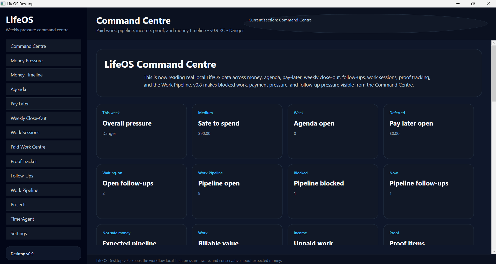
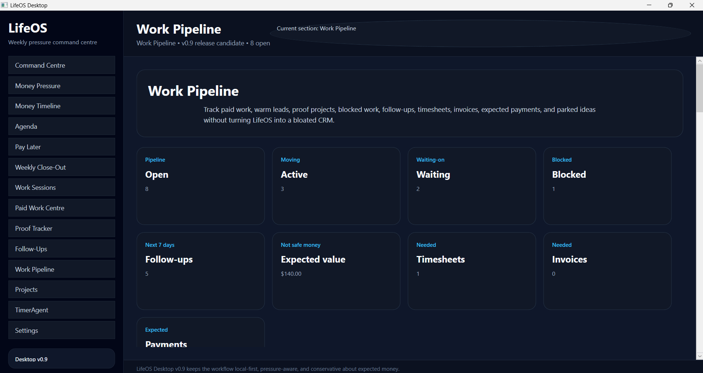
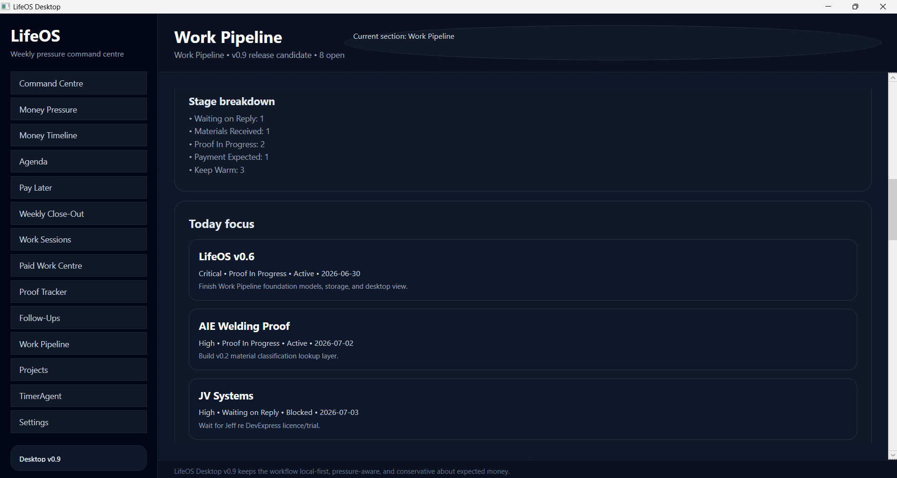
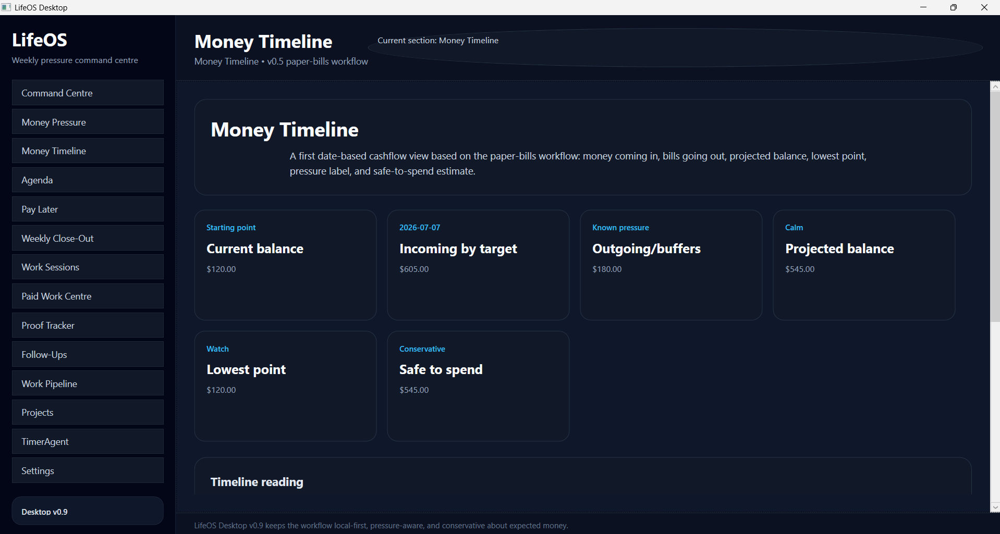
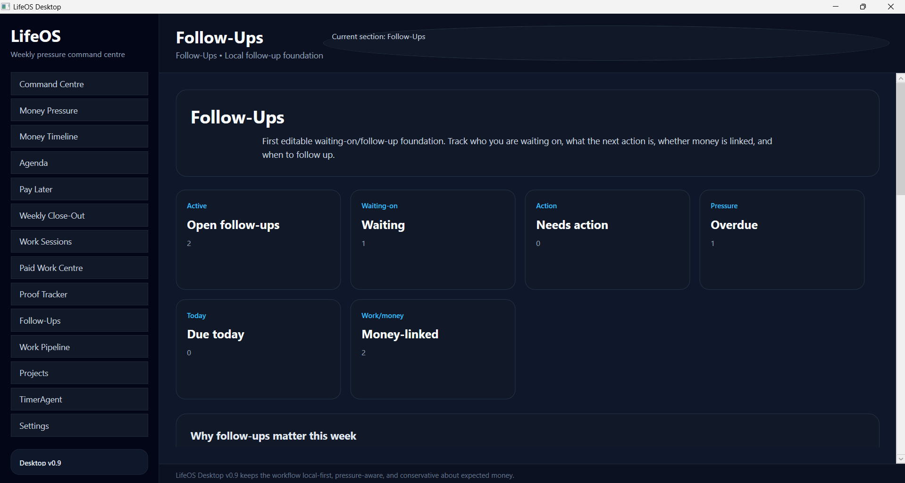
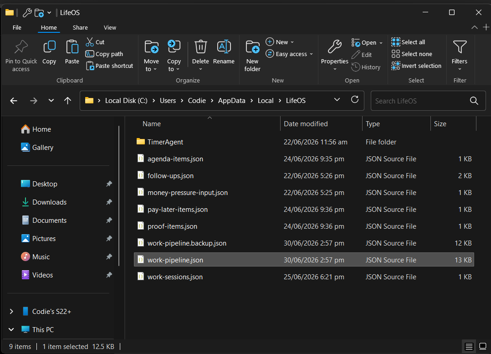

# LifeOS Desktop

LifeOS Desktop is a local-first weekly pressure command centre for tracking personal pressure, safe money, expected money, agenda items, deferred payments, weekly close-out, work sessions, paid work, proof items, follow-ups, projects, timers, and work pipeline pressure without turning the system into a heavy CRM, accounting platform, calendar replacement, or cloud product.

Current release: **LifeOS Desktop v0.9 — Work Pipeline + Command Centre Release Candidate**

## Release position

LifeOS Desktop v0.9 is the release-candidate baseline before the v1.0 Unified Command Centre push.

v0.6 to v0.9 added the Work Pipeline foundation, follow-up/opportunity behaviour, Command Centre signals, stage counts, storage backup safety, and workflow polish.

The current v0.9 spine is:

```text
work/opportunity exists -> stage it -> track follow-up/admin/money pressure -> surface it in Command Centre -> keep local JSON proof
```

## What v0.9 proves

v0.9 proves that LifeOS can connect practical work pressure to the Command Centre without becoming a bloated CRM.

It shows:

- active work and opportunities can be tracked through clear stages
- waiting, blocked, billable, timesheet, invoice, and expected-payment states are visible
- expected pipeline money is shown conservatively as not-safe money
- follow-ups and waiting-on pressure can feed the top-level view
- Work Pipeline data is stored locally in JSON with a backup file
- Command Centre can read across money, agenda, follow-ups, work sessions, proof, and pipeline pressure

## v0.9 boundaries

v0.9 is intentionally still local-first and desktop-focused.

It is:

- WPF desktop/core first
- JSON persisted
- pressure-aware and conservative about expected money
- a work/opportunity tracker, not a full CRM
- a planning and proof system, not accounting software
- a baseline before v1.0 unifies the Command Centre workflow

Not included yet:

- cloud sync
- mobile app
- client portal
- bank sync
- automated email sending
- final invoice/PDF generation
- enterprise multi-user workflows
- live hardware control

## v0.9 screenshots

### Command Centre



### Work Pipeline summary



### Work Pipeline stage breakdown and today focus



### Money Timeline



### Follow-Ups



### Local JSON storage proof



## Release history

### v0.1 — First usable desktop foundation

LifeOS became a real desktop app with a reusable shell, local data direction, dark UI foundation, and early navigation structure.

### v0.2 — Weekly pressure foundation

v0.2 added the first practical weekly-life systems:

- Agenda
- Pay Later
- Weekly Close-Out
- early Command Centre metrics
- clearer weekly pressure framing
- first screenshot/documentation pass

### v0.3 — Work, income, and proof foundation

v0.3 added the work/proof layer:

- Work Sessions
- Proof Tracker
- work and income metrics in the Command Centre
- proof visibility
- better MainWindow wiring
- updated v0.3 docs and screenshots

### v0.4 — Trust polish release

v0.4 improved reliability, wording, safety, reset confirmations, empty states, and documentation.

### v0.5 — Paid Work Centre + Money Timeline

v0.5 added the first paid-work admin layer and date-based Money Timeline.

It introduced:

- Paid Work Centre navigation
- invoice-ready session metrics
- copy-ready work summary generation
- Money Timeline navigation
- current balance / incoming / outgoing / projected balance view
- lowest point and safe-to-spend metrics
- Command Centre integration for unpaid work and billable value

### v0.6 — Work Pipeline foundation

v0.6 added the first Work Pipeline foundation.

It introduced:

- Work Pipeline models
- stage/status/priority tracking
- summary calculation
- local JSON storage
- desktop foundation for work pipeline visibility

### v0.7 — Follow-up and opportunity behaviour

v0.7 strengthened the Work Pipeline so it could handle follow-up states, waiting-on pressure, opportunity scoring, and follow-up bridging.

It introduced:

- follow-up state logic
- opportunity scoring direction
- waiting and follow-up views
- bridge behaviour between pipeline work and follow-up pressure

### v0.8 — Command Centre Work Pipeline integration

v0.8 connected Work Pipeline signals back into the Command Centre.

It introduced:

- pipeline open/blocked/follow-up counts
- work and money pressure signals
- expected pipeline value as not-safe money
- Command Centre visibility for pipeline pressure

### v0.9 — Release candidate polish

v0.9 is the consolidation pass before v1.0.

It adds:

- desktop version text polish
- Work Pipeline storage backup safety
- stage breakdown counts
- desktop stage display polish
- final v0.9 code polish

## Main modules

### Command Centre

The Command Centre reads local LifeOS data across money, agenda, pay-later, weekly close-out, follow-ups, work sessions, proof tracking, and Work Pipeline.

It gives a high-level view of:

- overall pressure
- safe-to-spend position
- open agenda items
- open pay-later/deferred payments
- open follow-ups
- pipeline open count
- pipeline blocked count
- pipeline follow-ups
- expected pipeline money
- billable work value
- unpaid work
- proof items

### Money Pressure

Money Pressure shows available money, known commitments, and pressure signals.

### Money Timeline

Money Timeline is the date-based cashflow view inspired by the paper-bills workflow.

It shows:

- current balance
- incoming by target date
- outgoing/buffers
- projected balance
- lowest point
- safe-to-spend
- pressure label

### Agenda

Agenda is a light weekly pressure list, not a full calendar replacement.

### Pay Later

Pay Later tracks deferred payment pressure such as Afterpay, bills, obligations, and future payments.

### Weekly Close-Out

Weekly Close-Out summarizes what happened, what carried forward, what needs attention, and what should be visible before the next week.

### Work Sessions

Work Sessions connects real work to income, invoices, proof, and follow-up pressure.

### Paid Work Centre

Paid Work Centre reviews completed billable work sessions and shows invoice-ready admin pressure.

### Proof Tracker

Proof Tracker tracks what was built, shown, paid, accepted, or made reusable.

### Follow-Ups

Follow-Ups tracks waiting-on items and reminders connected to work, clients, money, proof, or personal admin.

### Work Pipeline

Work Pipeline is the v0.6-v0.9 work/opportunity pressure layer.

It tracks:

- paid work
- warm leads
- proof projects
- blocked work
- client follow-ups
- payment states
- timesheet and invoice needs
- parked ideas
- stage counts
- today focus

It is deliberately not a full CRM.

### Projects

Projects keeps important work streams visible and findable.

### TimerAgent

TimerAgent is the early timer/work-session direction for future work tracking.

### Settings

Settings contains local app settings and future configuration direction.

## Local-first direction

LifeOS remains local-first while the core system is still being proven.

Current principle:

```text
Desktop/core first. MainWindow-only while moving fast. Core/Shared stay reusable. Local data stays safe.
```

v1.0 should focus on the Unified Command Centre Foundation: making the existing pieces work together so LifeOS can answer what matters now.
