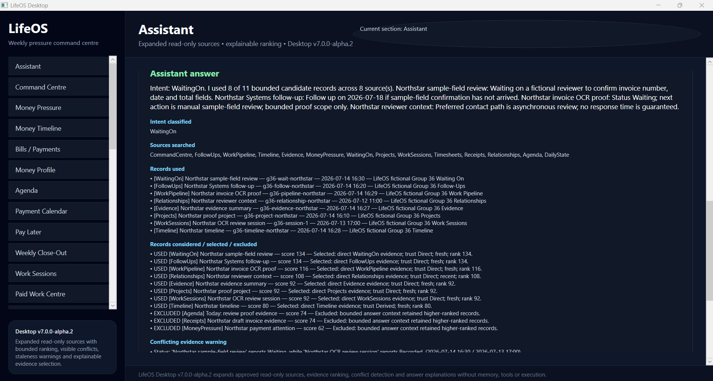

# LifeOS

**A local-first personal operating system for turning work, money, projects, follow-ups, evidence, relationships and daily pressure into visible, reviewable state.**

LifeOS is a safety-first platform built around a Windows desktop command centre, a lightweight Android Companion, guarded automation and a source-backed read-only Assistant.

> **Current checkpoint:** LifeOS Desktop `v7.0.0-alpha.2`



## Product status

| Product | Status |
|---|---|
| **LifeOS Desktop** | `v7.0.0-alpha.2` — active flagship platform |
| **LifeOS Mobile Companion** | `v0.1.0-beta.1` — beta complete and closed |
| **LifeOS Mobile** | Separate future full mobile application — not started |
| **LifeOS Website** | Planned public documentation and product site — not started |

The Mobile Companion and the future full Mobile application are separate products. They may share contracts and libraries, but they retain different scope, UX and release tracks.

## What LifeOS brings together

- Command Centre pressure and priority visibility
- projects, work pipeline, follow-ups and waiting-on tracking
- money pressure, payment attention and planning
- agenda, daily state, work sessions and timesheets
- evidence, receipts, timeline and provenance
- relationships and contextual records
- review-first integrations
- guarded, reversible internal automation
- source-backed Assistant answers

```text
Important information becomes visible state.
State affects pressure.
Pressure feeds the Command Centre.
Actions remain reviewable and controlled.
```

## v7 read-only Assistant

The Assistant answers questions from approved local LifeOS sources without gaining an execution path.

It can:

- classify a question before retrieval
- search only enabled local sources
- retrieve a bounded set of candidate records
- rank evidence by relevance, trust, freshness and directness
- combine evidence across sources while preserving provenance
- separate facts, inferences, uncertainty and missing data
- flag stale or conflicting records
- disclose records selected, excluded and considered
- return a non-executing suggestion for review

It cannot:

- send email or messages
- create or change calendar items
- mutate projects, tasks, money or other LifeOS state
- approve, confirm or continue orchestration
- launch scripts, processes, plugins or hidden tools
- perform external web search or connector writes
- run autonomously or in the background
- convert AI output directly into trusted LifeOS state

```text
question
-> classify intent
-> search enabled local sources
-> retrieve bounded candidates
-> rank evidence
-> detect conflicts, staleness and gaps
-> answer with provenance and uncertainty
```

### Approved source registry

The current registry includes:

- Command Centre
- Follow-Ups
- Work Pipeline
- Timeline
- Evidence
- Money Pressure and payment attention
- Waiting On
- Projects
- Work Sessions
- Timesheets
- Receipts
- Relationships
- Agenda
- Daily State

Each source is permission-controlled and can be enabled or disabled independently.

## Safety model

LifeOS is local-first, review-first and fail-closed.

- imported or generated information is not trusted automatically
- approval is separate from execution
- final confirmation is separate from approval
- stale state is revalidated before controlled execution
- only explicitly allowlisted reversible internal actions may execute
- before/after evidence and audit history are retained
- Emergency Stop remains authoritative
- external, destructive, communication, financial, script and autonomous AI actions remain blocked

The Assistant cannot bypass existing review, approval, final-confirmation, orchestration or Emergency Stop boundaries.

## Mobile Companion

The Android Companion is intentionally lightweight and was validated on a Samsung Galaxy S9.

Current beta capabilities:

- encrypted local Quick Capture
- offline Pending outbox
- explicit same-LAN pairing with Desktop
- verified acknowledgement before Delivered state
- Desktop intake as untrusted evidence requiring review
- idempotent duplicate handling
- visible failure and explicit manual retry
- read-only Agenda and Waiting-on / Work glance
- privacy-safe opt-in notifications
- conflict handling
- pairing reset and revocation
- no cloud account
- no background sync or automatic sending

## Verification

The Group 36 checkpoint completed with:

- **156/156 Core/Desktop tests passed**
- Companion tests passed
- Desktop Release build passed
- Android Release build passed
- NuGet vulnerability scan reported no vulnerable packages
- Gitleaks found no leaks
- `git diff --check` passed
- repository hygiene passed
- exactly 8 fictional-data screenshot proofs committed
- `HEAD` synchronized with `origin/main`
- clean working tree

## Evidence

### Current v7 checkpoint

- [Group 36 — source expansion and answer quality](docs/screenshot-groups/group-36-v7-source-expansion-answer-quality/)
- [Group 35 — Assistant foundation and safety boundary](docs/screenshot-groups/group-35-v7-assistant-foundation/)

### Mobile Companion

- [Group 34 — Companion beta checkpoint](docs/screenshot-groups/group-34-companion-beta-checkpoint/)

### Automation release

- [Group 31 — v6 controlled automation beta checkpoint](docs/screenshot-groups/group-31-v6-release-checkpoint/)

All public screenshot demonstrations use fictional records. **Northstar Systems** and **Project Zephyr Quill** are demonstration identities only.

## Repository structure

```text
LifeOS.Desktop/      WPF desktop application
LifeOS.Shared/       shared platform services and storage
src/                 core, Companion and supporting projects
tests/               Core/Desktop and Companion regression tests
docs/                status, releases, manual checks and screenshot evidence
tools/validation/    repository hygiene validation
.github/workflows/   continuous integration
```

## Build and validate

### Requirements

- Windows
- .NET 10 SDK
- Android workload only when building the Companion

```powershell
dotnet restore .\LifeOS.slnx
dotnet test .\LifeOS.slnx
dotnet build .\LifeOS.slnx -c Release
git diff --check
powershell.exe -NoProfile -ExecutionPolicy Bypass `
  -File .\tools\validation\Test-RepositoryHygiene.ps1 `
  -RepoPath C:\Projects\LifeOS
```

## Current development boundary

LifeOS is under active alpha development.

The current v7 lane improves the Assistant while preserving its strict read-only boundary. Group 37 has not started. Durable Assistant memory, autonomous tools, the full Mobile application and the public Website have not started.

## Technology

- C#
- .NET 10
- WPF
- .NET MAUI
- local encrypted storage
- GitHub Actions
- evidence-driven release validation

## Author

Built by **Codie Shannon** in Whakatāne, New Zealand.
