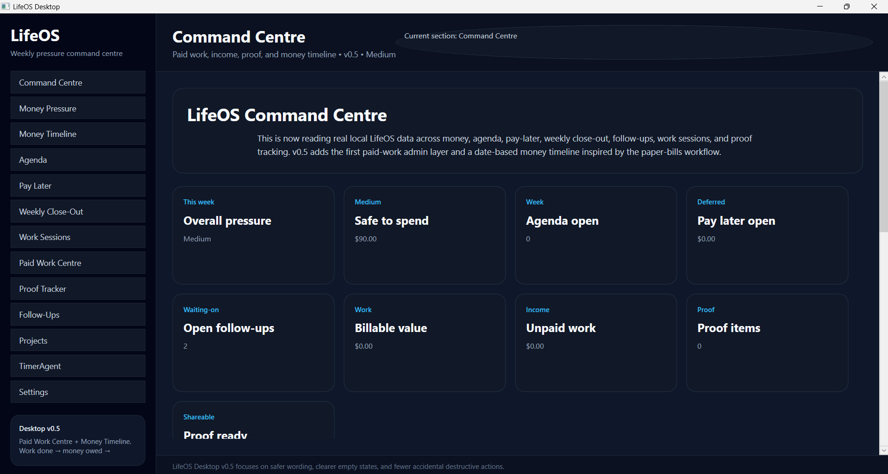
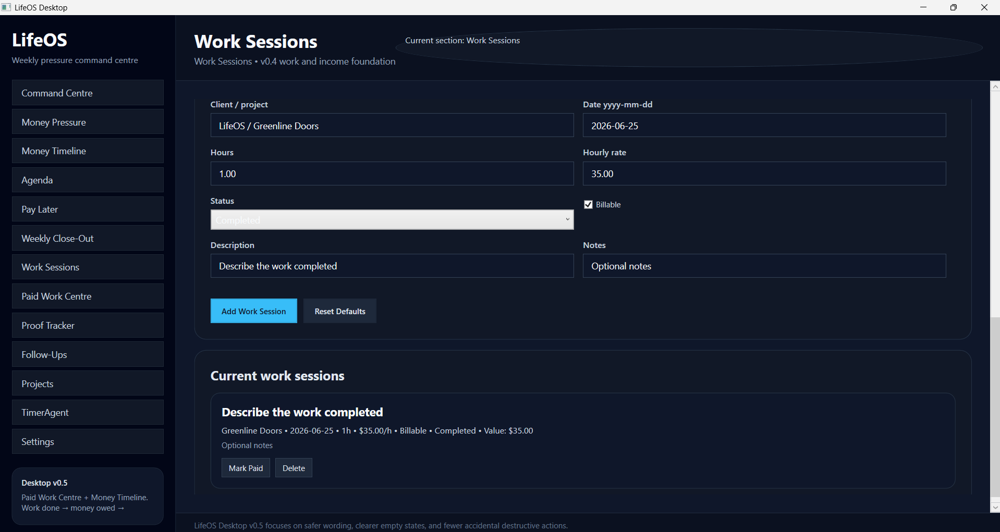
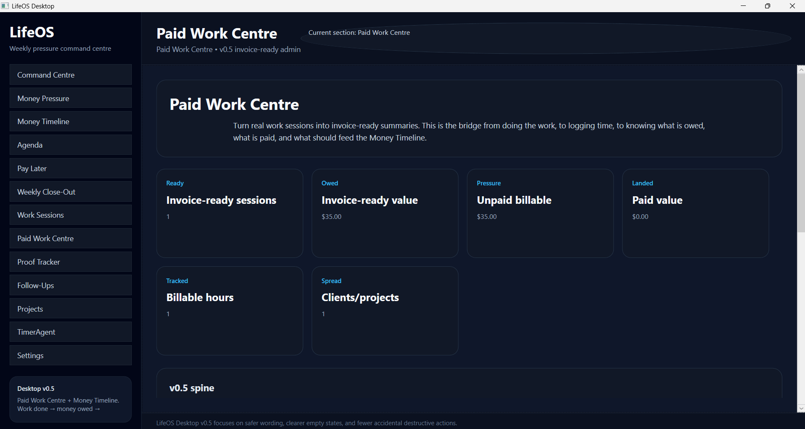
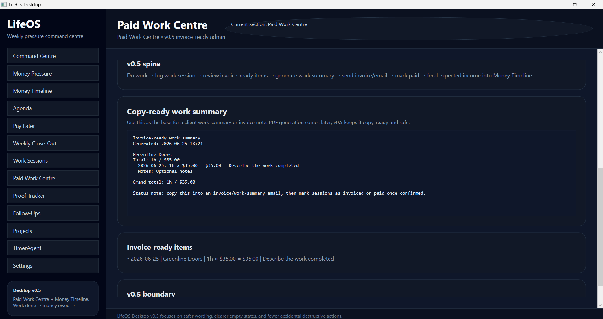
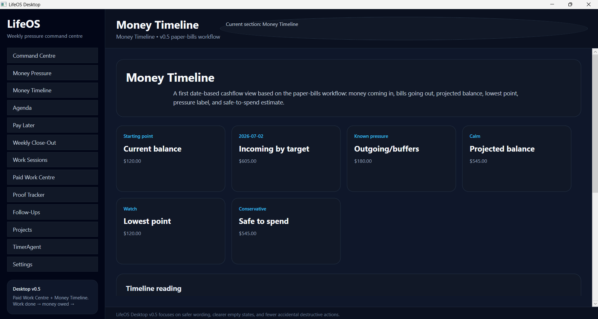
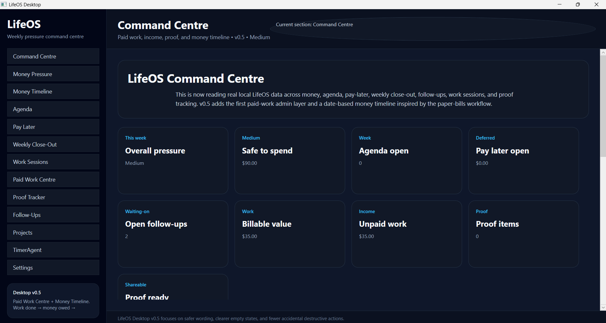

# LifeOS Desktop

LifeOS Desktop is a local-first weekly pressure command centre for tracking money pressure, agenda items, deferred payments, weekly close-out, work sessions, paid work, proof items, follow-ups, projects, timers, and settings without turning the system into a heavy calendar, CRM, accounting platform, or bank-sync product.

Current release: **LifeOS Desktop v0.5 — Paid Work Centre + Money Timeline**

## Release position

LifeOS v0.5 adds the first paid-work admin and date-based money timeline layer.

The release connects two real workflows:

1. **Paid Work Centre** — turns work sessions into invoice-ready summaries.
2. **Money Timeline** — turns current balance, expected income, bills, buffers, and unpaid work into a projected-balance / safe-to-spend view inspired by the paper-bills workflow.

The v0.5 spine is:

```text
do work -> log work session -> review invoice-ready items -> generate work summary -> expected payment -> money timeline -> safe-to-spend pressure view
```

## What v0.5 proves

v0.5 proves that LifeOS can connect work, money, and proof into a practical local-first desktop flow:

- work sessions can become invoice-ready items
- invoice-ready work can produce copy-ready summaries
- unpaid work can be visible in the Command Centre
- a paper-bills style money timeline can estimate projected balance and safe-to-spend
- paid-work pressure and money pressure can sit in the same command centre

## v0.5 boundaries

v0.5 is intentionally not a full accounting system.

It is:

- local-first WPF/JSON desktop workflow
- copy-ready invoice/work summaries, not final accounting
- projected-balance planning, not bank sync
- safe-to-spend guidance, not financial advice
- paid-work visibility, not tax filing
- desktop/core only, not mobile

Not included yet:

- final PDF invoice generation
- payment gateway integration
- bank feed/sync
- GST/tax filing logic
- client portal
- mobile app

## v0.5 screenshots

### Command Centre overview



### Work Sessions source data



### Paid Work Centre metrics



### Paid Work Centre invoice-ready summary



### Money Timeline projected balance



### Command Centre with v0.5 data



## Release history

### v0.1 — First usable desktop foundation

LifeOS became a real desktop app with a reusable shell, local data direction, dark UI foundation, and early navigation structure.

### v0.2 — Weekly pressure foundation

v0.2 added the first practical weekly-life systems:

- Agenda
- Pay Later
- Weekly Close-Out
- early Command Centre metrics
- clearer weekly pressure framing
- first screenshot/documentation pass

### v0.3 — Work, income, and proof foundation

v0.3 added the work/proof layer:

- Work Sessions
- Proof Tracker
- work and income metrics in the Command Centre
- proof visibility
- better MainWindow wiring
- updated v0.3 docs and screenshots

### v0.4 — Trust polish release

v0.4 improved reliability, wording, safety, reset confirmations, empty states, and documentation.

### v0.5 — Paid Work Centre + Money Timeline

v0.5 adds:

- Paid Work Centre navigation
- invoice-ready session metrics
- copy-ready work summary generation
- Money Timeline navigation
- current balance / incoming / outgoing / projected balance view
- lowest point and safe-to-spend metrics
- Command Centre integration for unpaid work and billable value
- updated v0.5 docs and screenshots

## Main modules

### Command Centre

The Command Centre reads local LifeOS data across money, agenda, pay-later, weekly close-out, follow-ups, work sessions, paid work, and proof tracking.

It gives a high-level view of:

- overall pressure
- safe-to-spend position
- open agenda items
- open pay-later/deferred payments
- open follow-ups
- billable value
- unpaid work
- proof items
- proof readiness

### Money Pressure

Money Pressure is the financial pressure view. It shows available money, known commitments, and pressure signals.

### Money Timeline

Money Timeline is the v0.5 date-based cashflow view.

It is based on the paper-bills workflow:

```text
current balance + incoming by target date - outgoing/buffers by target date = projected balance
```

It shows:

- current balance
- incoming by target date
- outgoing/buffers
- projected balance
- lowest point
- safe-to-spend
- pressure label

### Agenda

Agenda is a light weekly pressure list, not a full calendar replacement.

### Pay Later

Pay Later tracks deferred payment pressure such as Afterpay, bills, obligations, and future payments.

### Weekly Close-Out

Weekly Close-Out summarizes what happened, what carried forward, what needs attention, and what should be visible before the next week.

### Work Sessions

Work Sessions connects real work to income, invoices, proof, and follow-up pressure.

It tracks:

- client/project
- date
- hours
- hourly rate
- status
- billable flag
- description
- notes

### Paid Work Centre

Paid Work Centre is the v0.5 invoice-ready admin layer.

It reviews completed billable work sessions and shows:

- invoice-ready sessions
- invoice-ready value
- unpaid billable value
- paid value
- billable hours
- clients/projects
- copy-ready invoice/work summary
- invoice-ready item list

### Proof Tracker

Proof Tracker tracks what was built, shown, paid, accepted, or made reusable.

### Follow-Ups

Follow-Ups tracks waiting-on items and reminders connected to work, clients, money, proof, or personal admin.

### Projects

Projects keeps important work streams visible and findable.

### TimerAgent

TimerAgent is the early timer/work-session direction for future work tracking.

### Settings

Settings contains local app settings and future configuration direction.

## Local-first direction

LifeOS remains local-first while the core system is still being proven.

Current principle:

```text
Desktop/core first. MainWindow-only while moving fast. Core/Shared stay reusable. Local data stays safe.
```

Future versions may introduce stronger invoice generation, client proof packaging, sync, and eventually mobile support, but desktop/core remains the priority.

## Suggested release tag

```bash
git tag v0.5
git push origin v0.5
```

## Suggested final release commit message

```bash
git add .
git commit -m "Document LifeOS v0.5 paid work and money timeline release"
```
