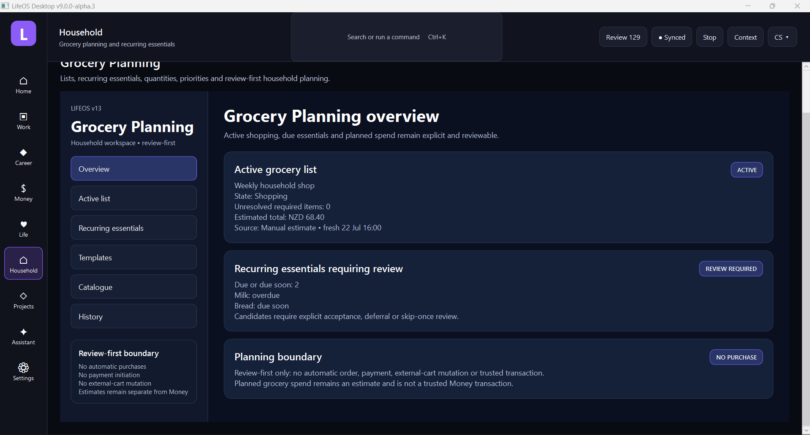

# LifeOS

**A local-first personal and work operating system for turning work, money, projects, evidence, household activity, integrations, AI review and daily pressure into visible, reviewable state.**

LifeOS is a safety-first platform built by Codie Shannon around purpose-built Desktop, Full Mobile, Mobile Companion and Website products. It is not a generic task list or template. It is an operations system for controlled review, execution, provenance and evidence.

> **Current checkpoint:** LifeOS v13 in progress. Group 64 is complete and synchronized at `50c43c9d8d801322a0e3f01baadab5ff8bbc89cc`; Group 65 is next.



## Product status

| Product | Status |
|---|---|
| **LifeOS Desktop** | Current deep administration, review, planning and audit surface through v13 Group 64 |
| **LifeOS Full Mobile** | Built through v10 Group 57 and extended through v13 Group 64 for mobile review, capture, execution and offline-safe grocery workflows |
| **LifeOS Mobile Companion** | Separate lightweight companion product, beta complete and closed |
| **LifeOS Website** | Website beta foundation complete through v8 Groups 40-42 |
| **Shared Core** | Authoritative contracts, deterministic validation, read models, provenance, audit, conflict and safety boundaries |
| **Current release lane** | v13 Household and Grocery; Group 64 complete, Group 65 next |

The Mobile Companion and Full Mobile application are separate products. They can share contracts and libraries, but they retain different scope, UX and release tracks.

## What LifeOS brings together

- Command Centre pressure and priority visibility
- work records, projects, next actions and proof linkage
- money records, invoices, payments, financial review and reports
- document and evidence intake with original preservation
- agenda, daily state, work sessions and timesheets
- relationship, communication and follow-up context
- review-first integrations across Google and Microsoft foundations
- guarded automation, AI review and bounded Assistant workflows
- Career Studio opportunity, application, materials, preparation and review flows
- Household and Grocery planning with recurring essentials and mobile shopping execution

```text
Important information becomes visible state.
State affects pressure.
Pressure feeds review.
Review controls action.
Evidence preserves trust.
```

## Current capability inventory

### Shell and workspaces

- Desktop shell with in-shell parent workspaces and child modules.
- Standard rule: child modules open inside the parent workspace and provide back navigation.
- Work, Career, Money, Life, Household, Projects and integration areas.
- Dark LifeOS visual language with selected navigation states, badges and boundary cards.

### Desktop

Desktop is the deep administration surface for detailed review, filtering, reporting, audit, evidence and planning. It includes Work, Money, Documents, Career Studio, Household/Grocery, integrations, Assistant, automation and historical operating modules.

### Full Mobile

Full Mobile is a separate .NET Android app. It is not a responsive copy of Desktop. It provides quick capture, review, execution, status and queued offline actions across Home, Work, Money, Documents, Evidence, Projects, Career and Grocery surfaces.

### Mobile Companion

The Companion remains a lighter product with local quick capture, pairing, delivery acknowledgement, notifications and review-first Desktop intake. It is not interchangeable with Full Mobile.

### Website

The Website beta foundation is built as the public product, documentation, evidence and future distribution surface. Later Portal, onboarding, installers, mobile packaging and public launch work remain v18 roadmap items.

### Integrations

LifeOS currently keeps provider surfaces read-only and review-first. Google Workspace and Microsoft provider foundations exist for mail, calendar, files and related read models. Guarded writes are deferred to v16.

### Money and documents

v11 added trusted local financial records, accounts, transactions, invoices, payments, allocations, document/evidence intake, preserved originals, review-first extraction and reporting/export boundaries. There are no bank feeds, payment initiation, accounting-provider writes or automatic reconciliation.

### Career Studio

v12 added opportunity and application pipelines, career evidence, CV and cover-letter materials, interview preparation, follow-ups, references and bounded analytics across Desktop and Full Mobile. LifeOS does not submit applications, message recruiters or fabricate claims.

### Household and Grocery

v13 Group 64 added Grocery Planning and recurring essentials across Desktop and Full Mobile: categorized lists, quantities, pack sizes, priorities, required dates, estimate freshness, mobile in-store actions, substitutions and offline conflict review. LifeOS does not automatically order, pay or mutate external carts.

## Safety model

LifeOS is local-first, review-first and fail-closed.

- Imported or generated information is not trusted automatically.
- Trust promotion requires explicit review.
- Conflicts preserve both versions until explicit resolution.
- Provider reads remain bounded and review-first.
- Guarded writes do not begin until v16.
- No autonomous financial posting, payment initiation, career applications, messaging, grocery ordering or destructive evidence handling.
- Original documents and evidence are preserved; exports and previews are derivatives.
- Provenance, freshness, confidence and audit history remain visible where relevant.

## Evidence

Current official evidence is stored under `docs/screenshot-groups/`. Completed groups use exactly eight approved screenshots unless a documented override exists.

Recent evidence:

- [Group 64 - Grocery planning and recurring essentials](docs/screenshot-groups/group-64-grocery-planning-essentials/)
- [Group 63 - Career follow-ups, analytics and v12 closure](docs/screenshot-groups/group-63-career-followups-analytics-closure/)
- [Group 62 - Career materials and interview preparation](docs/screenshot-groups/group-62-career-materials-interview-prep/)
- [Group 61 - Career opportunity and application pipeline](docs/screenshot-groups/group-61-career-opportunity-application/)
- [Group 60 - Financial review and reporting](docs/screenshot-groups/group-60-financial-review-reporting/)
- [Group 59 - Document and evidence intake](docs/screenshot-groups/group-59-document-evidence-intake/)
- [Group 58 - Money foundation](docs/screenshot-groups/group-58-money-foundation/)
- [Group 57 - Full Mobile beta closure](docs/screenshot-groups/group-57-full-mobile-beta-closure/)

All public screenshot demonstrations must use fictional, sanitized or explicitly approved proof data.

## Repository structure

```text
LifeOS.Desktop/      WPF desktop application
LifeOS.Shared/       shared platform services and storage
src/LifeOS.Core/     domain contracts, services and deterministic rules
src/LifeOS.Mobile/   full Android mobile application
src/LifeOS.Companion/ lightweight Android companion application
src/LifeOS.Website/  public website and documentation surface
tests/               Core, Mobile, Companion and Website regression tests
docs/                status, release notes, manual tests and screenshot evidence
tools/               validation and evidence helpers
.github/workflows/   continuous integration
```

## Build and validate

Requirements:

- Windows
- .NET 10 SDK
- Android workload when building mobile projects

```powershell
dotnet restore .\LifeOS.slnx
dotnet test .\LifeOS.slnx
dotnet build .\LifeOS.slnx -c Release
git diff --check
powershell.exe -NoProfile -ExecutionPolicy Bypass `
  -File .\tools\validation\Test-RepositoryHygiene.ps1 `
  -RepoPath C:\Projects\LifeOS
```

## Current development boundary

LifeOS v13 is active. Group 64 is complete and Group 65 is next.

Upcoming approved work runs through Groups 65-82, covering household inventory and meals, work sessions and invoicing, AI provider control, advanced read models, guarded writes, engineering visibility, packaging, Portal/onboarding and public launch validation.

Optional post-82 public branding/name migration, telemetry, extension SDK and cloud sync work remains unapproved planning only.

## Author

Built by **Codie Shannon** in Whakatane, New Zealand.
