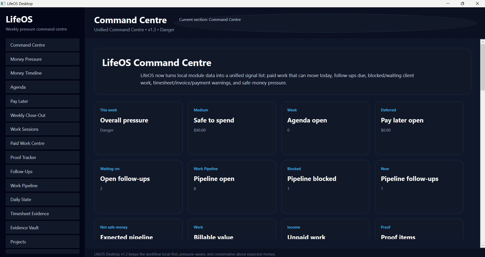
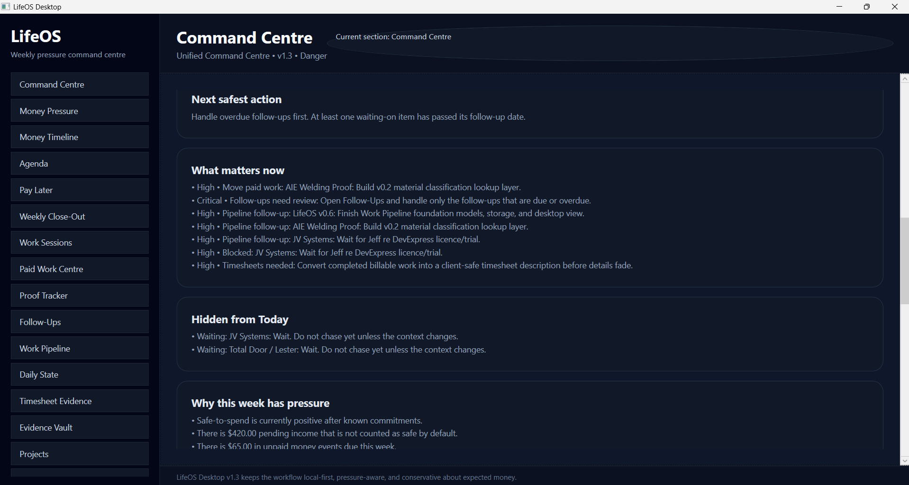
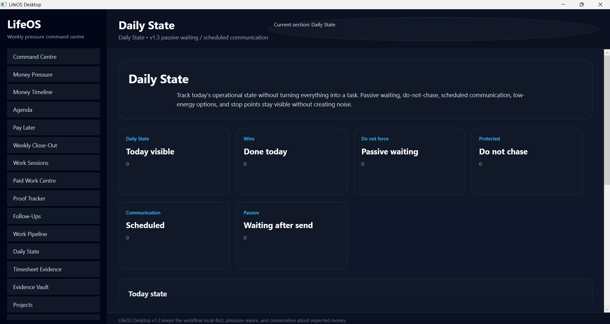
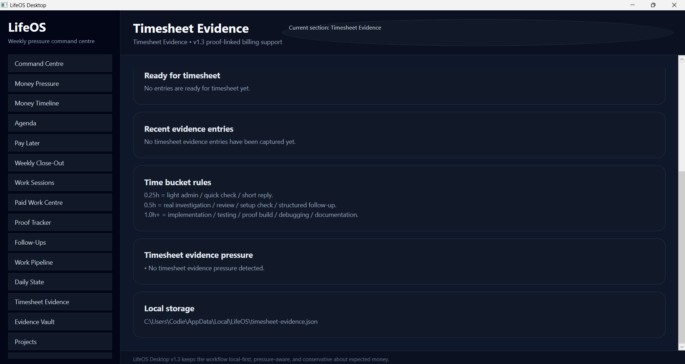
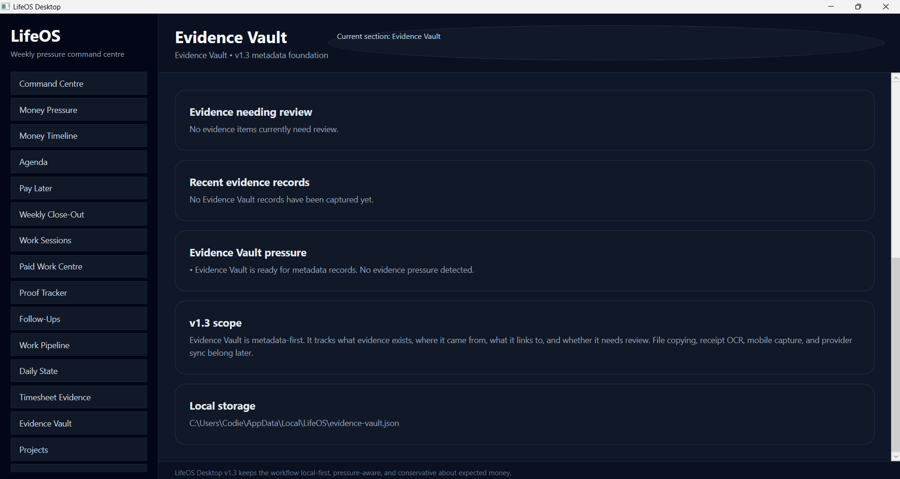
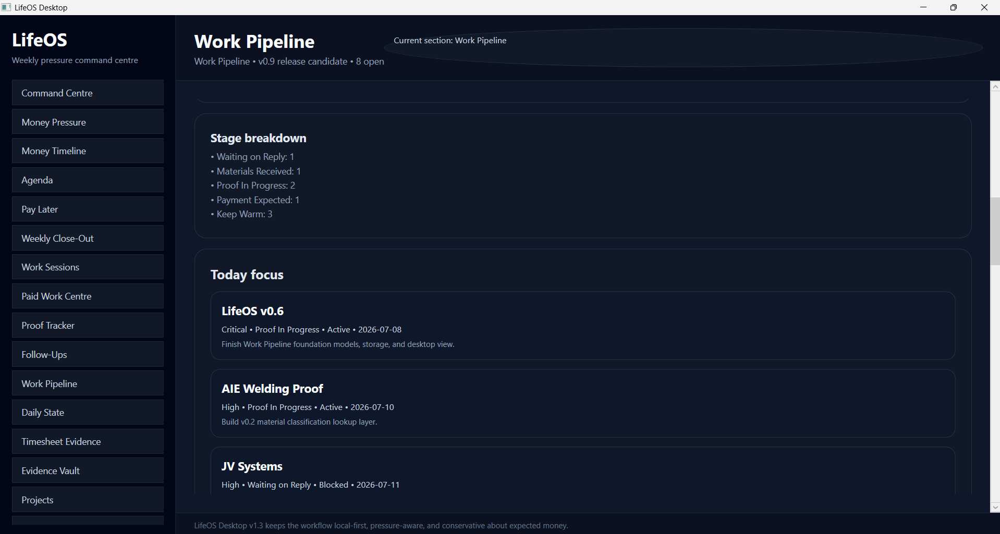

# LifeOS Desktop

LifeOS Desktop is a local-first command centre for reducing chaos across work, money pressure, follow-ups, proof, evidence, and daily execution.

Current release: **LifeOS Desktop v1.3.5 — Unified Command Centre + Evidence Vault Foundation**

## Release position

LifeOS v1.3.5 is the visible-page completion pass for the v1.3 release. It exposes the v1.1–v1.3 modules in the desktop sidebar and gives the release a clearer proof trail.

The v1.x direction is:

```text
local module data -> unified Command Centre signals -> next safest action -> proof/evidence trail
```

The core rule remains:

```text
Expected money is not safe money until paid.
```

## What v1.3 adds

### v1.0 — Unified Command Centre foundation

v1.0 introduced the Command Centre signal model and a stronger “what matters now” view.

It focuses on:

- paid work that can move today
- overdue/due follow-ups
- blocked or waiting client work
- timesheet, invoice, and payment warnings
- money pressure and safe-money awareness

### v1.1 — Daily state, passive waiting, and scheduled communication

v1.1 added manual daily state concepts so LifeOS can represent “wait” as a real status instead of turning everything into noise.

It supports:

- passive waiting
- do-not-chase state
- scheduled communication
- waiting after send
- low-energy options
- stop points

### v1.2 — Timesheet evidence and proof-linked work

v1.2 added the timesheet evidence layer.

It supports:

- client-safe timesheet wording
- suggested time bucket rules
- proof-linked billing support
- work-to-evidence thinking

Accepted time buckets:

```text
0.25h = light admin / quick check / short reply
0.5h  = real investigation / review / setup check / structured follow-up
1.0h+ = implementation / testing / proof build / debugging / documentation
```

### v1.3 — Evidence Vault metadata foundation

v1.3 added the metadata-first Evidence Vault foundation.

It supports:

- evidence records
- evidence type/status
- needs-review state
- linked work/project context
- local source/path references
- notes
- Command Centre evidence pressure

v1.3 deliberately does **not** add receipt OCR, mobile capture, cloud sync, provider integrations, accounting automation, or automatic sending.

## v1.3 screenshots

### Command Centre summary



### Today / next action



### Daily State / passive waiting



### Timesheet Evidence



### Evidence Vault



### Work Pipeline still connected



## Main modules

### Command Centre

The Command Centre is the home screen and the main operating loop. It reads LifeOS module data and surfaces what matters now.

It shows:

- next safest action
- what matters now
- hidden/passive waiting items
- money pressure
- paid work pressure
- follow-up pressure
- proof/evidence pressure

### Work Pipeline

Work Pipeline tracks paid work, warm leads, proof projects, blocked work, payment states, and parked ideas.

It is not a full CRM. It is a practical pressure and opportunity tracker.

### Daily State

Daily State tracks operational state without forcing everything into a task.

It covers:

- passive waiting
- do-not-chase
- scheduled communication
- done-today state
- low-energy options
- stop points

### Timesheet Evidence

Timesheet Evidence helps turn work into billable/admin proof.

It captures:

- work context
- time bucket
- client-safe wording
- proof/evidence link
- readiness pressure

### Evidence Vault

Evidence Vault stores metadata-first evidence records.

Top evidence types for the v1.x foundation:

1. Screenshots
2. Email/message proof
3. Work session notes
4. Timesheet descriptions
5. Code commits / repo history

### Money Pressure and Money Timeline

Money Pressure and Money Timeline keep safe money separate from expected money.

Expected income is visible, but does not reduce pressure until paid.

## Version history

### v0.1 — First usable desktop foundation

Reusable shell, local data direction, dark UI foundation, and early navigation.

### v0.2 — Weekly pressure foundation

Added Agenda, Pay Later, Weekly Close-Out, and early weekly pressure framing.

### v0.3 — Work, income, and proof foundation

Added Work Sessions, Proof Tracker, work/income metrics, and proof visibility.

### v0.4 — Trust polish release

Improved reliability, wording, safety, confirmations, empty states, and docs.

### v0.5 — Paid Work Centre + Money Timeline

Added Paid Work Centre and date-based Money Timeline.

### v0.6 — Work Pipeline foundation

Added Work Pipeline models, stage/status/priority tracking, summary calculation, storage, and desktop visibility.

### v0.7 — Follow-up and opportunity behaviour

Strengthened follow-up states, waiting-on pressure, opportunity scoring, and follow-up bridging.

### v0.8 — Command Centre Work Pipeline integration

Connected Work Pipeline signals into Command Centre.

### v0.9 — Work Pipeline release candidate polish

Added backup safety, stage counts, desktop stage display polish, and v0.9 documentation/screenshots.

### v1.0 — Unified Command Centre foundation

Added signal model, snapshot builder, today actions, and a stronger Command Centre foundation.

### v1.1 — Daily State foundation

Added daily state, passive waiting rules, scheduled communication, and Command Centre integration.

### v1.2 — Timesheet Evidence foundation

Added timesheet evidence model, helper rules, proof links, and Command Centre pressure signals.

### v1.3 — Evidence Vault foundation

Added metadata-first Evidence Vault records, storage, linking, and Command Centre evidence signals.

### v1.3.5 — Visible v1.3 pages

Exposed Daily State, Timesheet Evidence, and Evidence Vault as visible desktop pages.

## Current boundaries

LifeOS Desktop v1.3.5 is still:

- local-first
- desktop-focused
- manual-first
- JSON persisted
- conservative about expected money
- designed around reducing pressure and increasing control

Not included yet:

- mobile app
- cloud sync
- Outlook/Gmail live integration
- receipt OCR
- bank/accounting integration
- automatic email sending
- enterprise/team mode

## Roadmap direction

The next roadmap target is **LifeOS Desktop v2.0** as the full paid desktop roadmap version.

v2.0 should include the core desktop feature set in manual/local-first form. Automation, mobile, provider integrations, OCR, and sync come later.


## LifeOS Desktop v1.4 - Evidence Vault Usable Workspace

LifeOS v1.4 turns Evidence Vault from a metadata foundation into a usable local workspace for proof records. It supports manual evidence capture, local persistence, review pressure, source/reference tracking, linked work context, status changes, archive/delete actions, and safe fictional demo records.

No OCR, cloud sync, mobile capture, provider integration, automatic imports, or automatic sending are included in this version.
