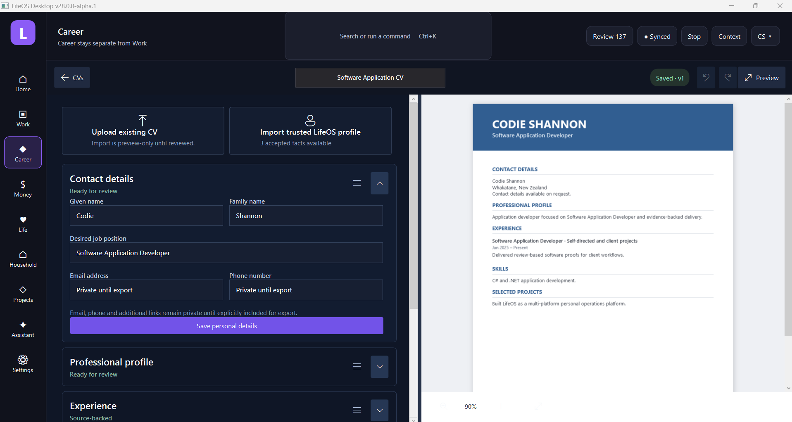

# LifeOS

**A local-first personal and work operating system for turning work, money, projects, evidence, household activity, integrations, AI review and daily pressure into visible, reviewable state.**

LifeOS is a safety-first platform built by Codie Shannon around purpose-built Desktop, Full Mobile, Mobile Companion and Website products. It is an operations system for controlled review, execution, provenance and evidence—not a generic task list or template.

> **Current checkpoint:** LifeOS v28.0.0-alpha.16 is active through Group 184. Relationships & Contact Context now provides validated local relationship memory, visible waiting state and respectful next actions without contact import, automatic chasing, messaging or provider writes. The preserved v27/Group 120 release candidate remains historical evidence, not a promise that feature development has ended.



## Product status

| Product | Status |
|---|---|
| **LifeOS Desktop** | Current through Group 184, including ordinary-mode Relationships, Focus Timer, Agenda, Weekly Review, Life, Household, Documents, Money Pressure, Work Time and Projects, validated forms, actionable problems and local-data recovery |
| **LifeOS Full Mobile** | Purpose-built Android application aligned through Group 132, including opportunity capture, career review and derivative sharing |
| **LifeOS Mobile Companion** | Separate lightweight companion product; beta complete and closed |
| **LifeOS Website** | Product, documentation, onboarding, factual portfolio and release-candidate evidence surface |
| **Shared Core** | Authoritative contracts, deterministic validation, read models, provenance, audit, conflict and safety boundaries |
| **Current release lane** | v28 ordinary-mode productization; Relationships and Contact Context complete through SG-184 Pack 2 |

Full Mobile and Mobile Companion are separate products. They can share contracts and libraries, but retain different scope, UX and release tracks.

## What LifeOS brings together

- Command Centre pressure and priority visibility
- work records, sessions, billable time, projects, next actions and proof linkage
- money records, invoices, payments, financial review and reports
- document and evidence intake with original preservation
- agenda, daily state, household, grocery and shared-routine workflows
- relationship, communication and follow-up context
- Google and Microsoft provider foundations with review-first integration intake
- guarded provider contracts, explicit approval boundaries and audit
- native deterministic intelligence plus optional provider-backed AI review
- scheduled-communication proposals without silent or automatic sending
- Career Studio opportunity, application, materials and preparation flows
- documentation, packaging, validation and closed-beta readiness tooling

```text
Important information becomes visible state.
State affects pressure.
Pressure feeds review.
Review controls action.
Evidence preserves trust.
```

## Product surfaces

### Desktop

The deep administration surface for detailed review, filtering, reporting, audit, evidence and planning across Work, Career, Money, Life, Household, Projects, integrations, Assistant and Settings.

### Full Mobile

A separate .NET Android application—not a responsive copy of Desktop—for quick capture, review, execution, status and queued offline actions.

### Mobile Companion

A lighter product for local quick capture, pairing, delivery acknowledgement, notifications and review-first Desktop intake. It is not interchangeable with Full Mobile.

### Website

The product, documentation and evidence foundation. Website packaging,
onboarding and the cross-product release-candidate gate are complete through
Group 120.

## Current capability lanes

- **Work and operating day:** work sessions, billable records, timesheet proof and operating-day review.
- **Money and documents:** trusted local financial records, preserved evidence, review-first extraction and derivative reporting/export.
- **Career Studio:** opportunity and application pipelines, evidence-backed materials, interview preparation and bounded analytics.
- **Household and Grocery:** inventory, meals, stores, recurring essentials, shared routines, receipt candidates and spending review.
- **Provider integrations:** normalized, source-backed candidates with explicit review, duplicate detection, conflict handling and provenance.
- **Guarded provider contracts:** permission, preview, confirmation, audit, cancellation and Emergency Stop boundaries; external writes remain disabled at the current checkpoint.
- **Native intelligence and optional AI:** deterministic local insights remain primary; external AI is optional, bounded and review-first.
- **Scheduled communications:** proposals, timing, readiness and audit are modeled without automatic sending or autonomous messaging.
- **Product readiness:** documentation and packaging hub, closed-beta baseline, release proof and validation tooling.

## Safety model

LifeOS is local-first, review-first and fail-closed.

- Imported or generated information is not trusted automatically.
- Trust promotion and authoritative linking require explicit review.
- Conflicts preserve both versions until explicit resolution.
- Provider access is bounded; external writes remain disabled.
- No autonomous financial posting, payment initiation, career applications, messaging, grocery ordering or destructive evidence handling.
- Original documents and evidence are preserved; exports and previews are derivatives.
- Provenance, freshness, confidence and audit history remain visible where relevant.
- AI cannot silently mutate authoritative LifeOS state.

## Evidence

Official evidence is stored under [`docs/screenshot-groups/`](docs/screenshot-groups/). The standard target is eight approved screenshots per screenshot group; a group may document a smaller genuine-capture override when the available product surfaces do not support eight distinct truthful views.

Recent evidence:

- [Groups 181-184 - Relationships and Contact Context](docs/screenshot-groups/group-181-184-relationships-contact-context/)
- [Groups 177-180 - Focus Timer and Session Control](docs/screenshot-groups/group-177-180-focus-timer-session-control/)
- [Groups 173-176 - Agenda and Commitment Planning](docs/screenshot-groups/group-173-176-agenda-commitment-planning/)
- [Groups 169-172 - Weekly Review and Personal Planning](docs/screenshot-groups/group-169-172-weekly-review-personal-planning/)
- [Groups 165-168 - Life Routines and Personal Administration](docs/screenshot-groups/group-165-168-life-routines-personal-admin/)
- [Groups 161-164 - Household and Grocery Planning](docs/screenshot-groups/group-161-164-household-grocery-planning/)
- [Groups 157-160 - Documents and Evidence Intake](docs/screenshot-groups/group-157-160-document-evidence-intake/)
- [Groups 153-156 - Money Pressure and Safe to Spend](docs/screenshot-groups/group-153-156-money-pressure-safe-spend/)
- [Groups 149-152 - Work Time and Billable Records](docs/screenshot-groups/group-149-152-work-time-billable-records/)
- [Groups 145-148 - Projects and Delivery](docs/screenshot-groups/group-145-148-projects-delivery/)
- [Groups 141-144 - Forms and Actionable Problems](docs/screenshot-groups/group-141-144-forms-actionable-problems/)
- [Groups 137-140 - Navigation and Shell Search](docs/screenshot-groups/group-137-140-navigation-shell-search/)
- [Groups 133-136 - Local Data and Recovery Spine](docs/screenshot-groups/group-133-136-local-data-recovery/)
- [Groups 121-124 - CV Builder Foundation](docs/screenshot-groups/group-121-124-cv-builder-foundation/)
- [Groups 117-120 - Product-Complete Release Candidate](docs/screenshot-groups/group-117-120-product-complete-release-candidate/)
- [Groups 112-116 - Website Packaging and Onboarding](docs/screenshot-groups/group-112-116-website-packaging-onboarding/)
- [Groups 108-111 - Privacy, Export, Backup and Controls](docs/screenshot-groups/group-108-111-privacy-export-backup-controls/)
- [Groups 104-107 - Evidence Automation and Proof Tooling](docs/screenshot-groups/group-104-107-evidence-automation-proof-tooling/)
- [Groups 99-103 - New Zealand Grocery Lookup Worker](docs/screenshot-groups/group-99-103-nz-grocery-lookup-worker/)
- [Groups 95-98 — Pay-Later and Money Integrations](docs/screenshot-groups/group-95-98-pay-later-money-integrations/)
- [Groups 91-94 — Social and Messaging Integrations](docs/screenshot-groups/group-91-94-social-messaging-integrations/)
- [Groups 87-90 — Scheduled Communications](docs/screenshot-groups/group-87-90-scheduled-communications/)
- [Groups 83-86 — Native Intelligence and Optional AI](docs/screenshot-groups/group-83-86-native-intelligence/)
- [Groups 80-82 — Closed Beta Baseline](docs/screenshot-groups/group-80-82-closed-beta-baseline/)
- [Groups 77-79 — Documentation and Packaging Hub](docs/screenshot-groups/group-77-79-documentation-packaging-hub/)
- [Groups 73-76 — Guarded Provider Contracts](docs/screenshot-groups/group-73-76-guarded-provider-contracts/)
- [Groups 69-72 — Operating Day Work Proof](docs/screenshot-groups/group-69-72-operating-day-work-proof/)
- [Groups 67-68 — Work Time and Billable Records](docs/screenshot-groups/group-67-68-work-time-billable-records/)

All public demonstrations must use fictional, sanitized or explicitly approved proof data.

## Repository structure

```text
LifeOS.Desktop/       WPF desktop application
LifeOS.Shared/        shared platform services and storage
src/LifeOS.Core/      domain contracts, services and deterministic rules
src/LifeOS.Mobile/    full Android mobile application
src/LifeOS.Companion/ lightweight Android companion application
src/LifeOS.Website/   public website and documentation surface
tests/                Core, Mobile, Companion and Website regression tests
docs/                 status, release notes, manual tests and screenshot evidence
tools/                validation, packaging and evidence helpers
.github/workflows/    continuous integration
```

## Build and validate

Requirements:

- Windows
- .NET 10 SDK
- Android workload when building mobile projects

```powershell
dotnet restore .\LifeOS.slnx
dotnet test .\LifeOS.slnx
dotnet build .\LifeOS.slnx -c Release
git diff --check
powershell.exe -NoProfile -ExecutionPolicy Bypass `
  -File .\tools\validation\Test-RepositoryHygiene.ps1 `
  -RepoPath C:\Projects\LifeOS
```

## Current development boundary

LifeOS v28.0.0-alpha.16 is active through Group 184. Relationships & Contact
Context now has a real ordinary-mode local workspace on the shared storage,
forms and problem-state spine. SG-184 Pack 2 is closed with exact,
inspected product and validation evidence. SG-128 visible
Pack 2 evidence remains open; v27 release-candidate evidence remains preserved
in SG-120.

## Author

Built by **Codie Shannon** in Whakatane, New Zealand.
