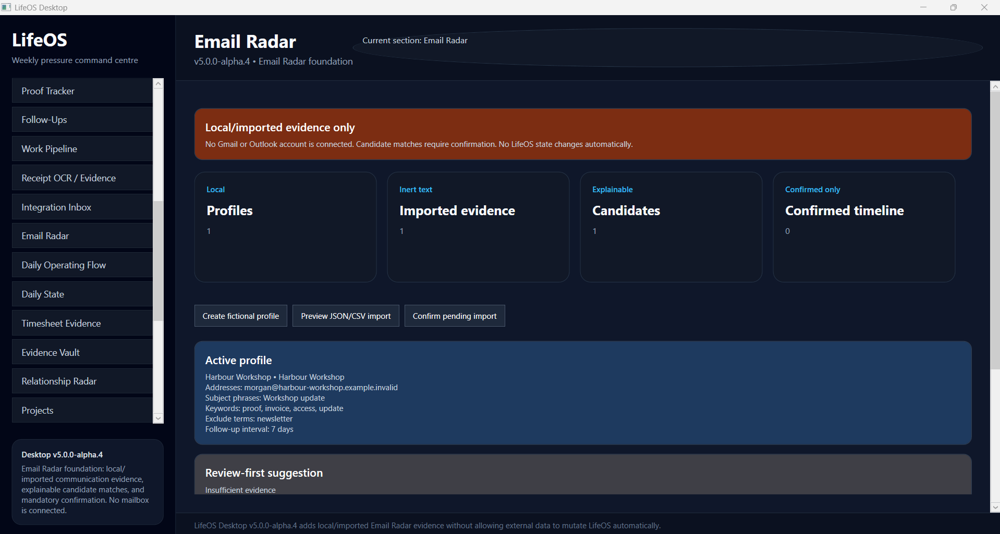
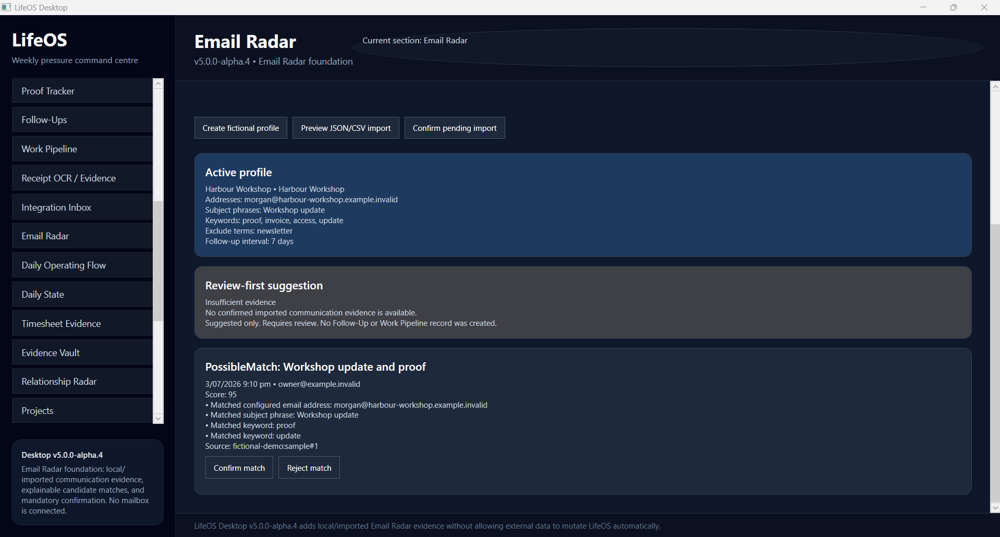
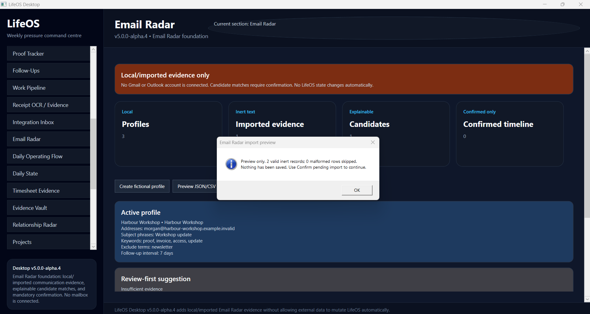
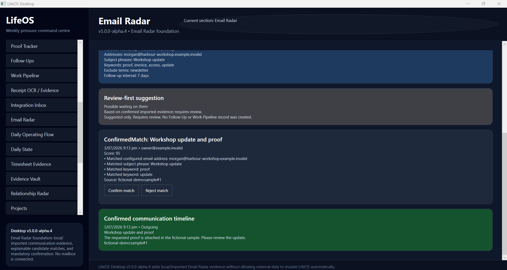
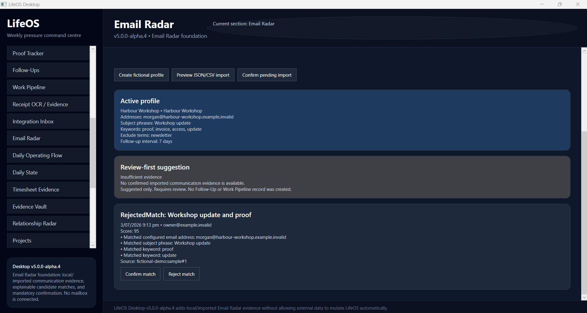
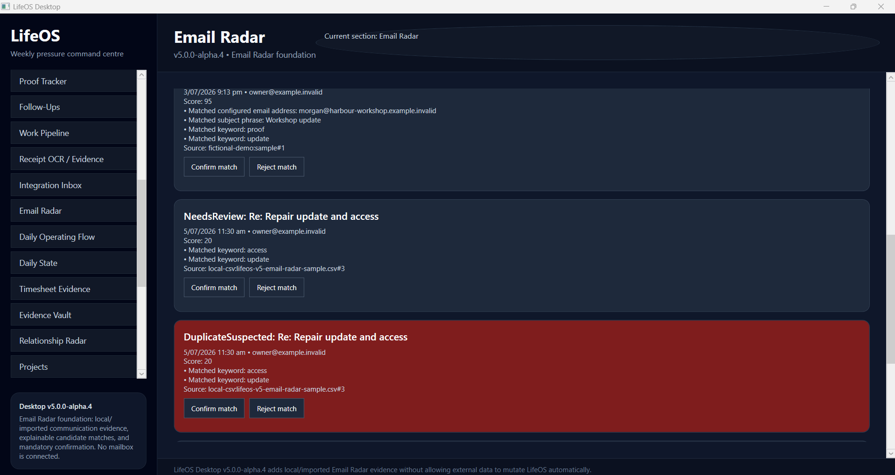

# Screenshot Group 24 — Email Radar foundation

## Version

`v5.0.0-alpha.4`

## Outcome

Group 24 formally aligned LifeOS to one coherent version state and added the provider-neutral Email Radar foundation using local/imported communication evidence only.

The evidence proves:

- visible `v5.0.0-alpha.4` product identity
- no Gmail or Outlook account connected
- user-guided fictional Email Radar profile
- preview before import and explicit confirmation requirement
- deterministic possible-match reasons
- confirmed-only communication timeline
- review-first waiting-on suggestion
- rejected-match state
- duplicate-suspected state with provenance
- no automatic Follow-Up or Work Pipeline mutation

## Screenshots

### 1. Version, safety boundary, and profile

Shows the formal version, Email Radar subtitle, local/import-only banner, profile summary, and current counts.

### 2. Possible match with explained reasons

Shows an untrusted possible match, deterministic score, configured-address match, subject phrase match, keyword reasons, provenance, and explicit confirm/reject controls.

### 3. Import preview requires confirmation

Shows valid inert records in preview state and explicitly states that nothing has been saved before confirmation.

### 4. Confirmed match, timeline, and review-first suggestion

Shows a confirmed match, outgoing direction, source-backed communication timeline, and “Possible waiting on them” wording that requires review and creates no Follow-Up or Work Pipeline record.

### 5. Rejected match and mutation boundary

Shows explicit rejection and the retained boundary that no operational record was created automatically.

### 6. Duplicate suspected with provenance

Shows duplicate suspicion as a visible review state rather than silent acceptance, with match reasons and local CSV provenance retained.

## Verification

- Tests: **80 passed, 0 failed, 0 skipped**
- Release build: **succeeded**
- `git diff --check`: **passed** before product commit and screenshot/docs finalization
- Product commits:
  - `1743652` — `chore: centralize v5 alpha version state`
  - `0da2eb0` — `feat: add email radar foundation`

## Boundary retained

No Gmail, Outlook, Microsoft Graph, IMAP, POP3, mailbox connection, message sending, inbox mutation, background scanning, AI interpretation, automatic Follow-Up creation, or automatic Work Pipeline update exists in Group 24.

Group 25 has not started.
